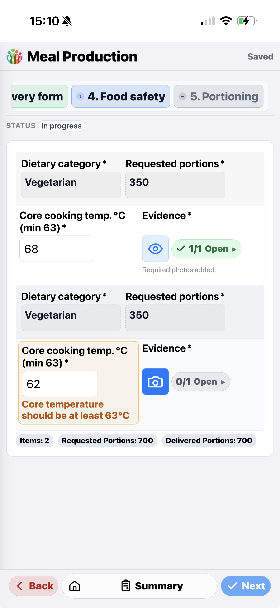
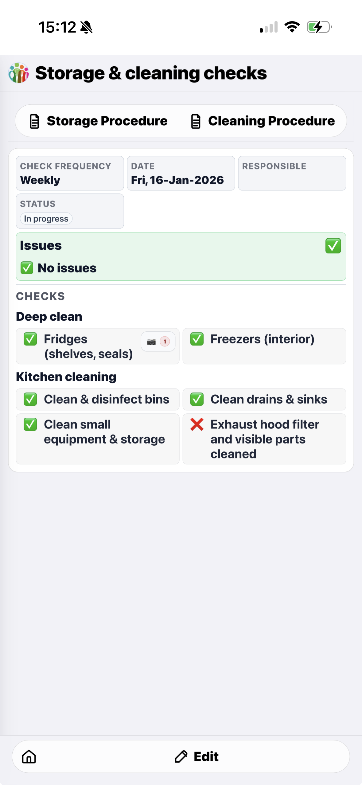

# community-kitchen

A Google Apps Script project that helps organizations digitize their processes with a professional, user-friendly web app.

## Objective

- Provide a professional, intuitive, user-friendly interface that requires no training.
- Help any organization digitize their processes, especially those without budget for expensive licenses.
- Offer a free solution that can be deployed and operated via Google Apps Script, with additional infrastructure options in the future.
- Make configuration AI-friendly via comprehensive setup instructions and a configuration contract that follows OpenAPI standards.

## Screenshots

Meal Production (Steps UI) | Recipes (Home Page) | Storage and cleaning checks (Summary View)
--- | --- | ---
 |  | 

## Features

### Core experience

- **Multi-language Support (max 3)**: Supports English/French/Dutch (Belgian Dutch) with per-form language config (enabled languages + default language). You can also disable language selection and force a single default language.
- **Dashboard Management**: Manage multiple forms from a single "Forms Dashboard" sheet.
- **Smart Updates**: Updates existing forms without breaking links or losing data.
- **Archiving**: Soft-delete questions by marking them as "Archived" in the config sheet.
- **Destination Management**: Automatically renames response tabs for better organization.
- **Custom Web App Forms**: Generate Apps Script web apps (via `doGet`) that support line items and file uploads while still writing back to your Sheets.
- **Unified Shell & Navigation**: Excel-style header (logo circle + form title) with a left drawer (Refresh / Language (optional) / Build), plus a top action bar under the header and a fixed bottom action bar that adapt per view (List/Summary/Form). You can override the Summary button label per form via `summaryButtonLabel`.
- **Header logo (optional)**: Show a Drive-backed logo image in the app header via dashboard JSON: `"appHeader": { "logo": "<drive file id or share URL>" }`.
- **Configurable action bars (per form)**: Use the dashboard `"actionBars"` config to control which system buttons (Home/Create/Edit/Summary/Submit/Actions) and which custom BUTTON groups appear in the top/bottom bars per view, including order and visibility.
- **Feature flags (per form)**: You can disable some UI features via the dashboard config JSON, e.g. `"summaryViewEnabled": false`, `"copyCurrentRecordEnabled": false`, `"createNewRecordEnabled": false`, `"createRecordPresetButtonsEnabled": false`, `"languageSelectorEnabled": false`, or `"listView": { "headerSortEnabled": false }` (disable header-click sorting).
- **Create/Copy UX (per form)**: Customize Create/Copy labels via `"createButtonLabel"` / `"copyCurrentRecordLabel"`, and force re-entry on copied records by clearing fields via `"copyCurrentRecordDropFields": ["FIELD_ID", ...]`.
- **App-like iOS Edit UI**: The edit view uses an iOS grouped visual style, a fixed bottom action bar (Home/Create/Summary/Submit) with safe-area padding, and supports 2-up field grids where space allows. CHOICE fields can render as segmented/radio/select/switch (auto-defaults with per-field overrides), and CHECKBOX fields with no options render as a single consent checkbox.
- **React Shell Only**: The published web app renders the React UI automatically; the legacy iframe template has been removed.

### Data, rules, and configuration

- **Field-level guarded changes (ck-47)**: Configure per-field `changeDialog` rules (top-level or line-item fields) to pause autosave and confirm edits when `changeDialog.when` matches after a change. You can add dialog `inputs` to update peer fields, parent fields, or selection-effect rows (`target.scope: "row" | "parent" | "top" | "effect"` with `effectId`). On confirm, a dedup precheck runs for reject-rule keys (or `dedupMode: "always"`); on cancel/conflict, the change is reverted and autosave resumes.

- **Dynamic Options & Rules**: Option filtering based on another field plus cross-field validation rules (main form and line items), including non-blocking warning rules (`level: "warning"`).
- **Line-item aware visibility**: `visibility` supports `lineItems` clauses to show/hide top-level fields or BUTTONs based on row-level conditions in line-item groups or subgroups, with optional parent-scoped matching via `parentWhen` (for example, only show an Ingredients button when a non-reheat parent row has a manual ingredient entry).
- **Localized Sorting & Tooltips**: All option lists sort alphabetically per language; options can show tooltips from data sources (with inline fallback).
- **Derived TEXT Maps**: TEXT fields (and line-item fields) can be readonly value-maps that derive their content from another field via `optionMap` (inline) or `optionMapRef` (sheet-driven).
- **Computed Fields**: `derivedValue` can auto-calculate fields (including numeric formulas with `SUM(GROUP.FIELD)` aggregates), prefill DATE fields with today, map time-of-day into a default value, or copy a default value from another field (e.g., NUMBER defaults), and keep them hidden/system-managed.
- **Default Values**: `defaultValue` can prefill fields on new records/new rows (top-level + line items) without overriding user edits. `selectionEffects.type="addLineItems"` presets can reference `$row.FIELD_ID` and `$top.FIELD_ID` to copy values into newly created rows. Selection effects also support `type: "setValue"` to update a field in the current row or top-level record (supports `$row.` / `$top.` refs and `null` to clear), `when` gating (visibility-style conditions, including numeric comparisons), `hideRemoveButton` (suppress Remove for effect-created rows), and `type: "deleteLineItems"` (delete linked child rows; cascade deletion prevents orphaned rows). Generated rows are filtered by the target fields' `optionFilter` allowlists (disallowed mapped values are skipped).
- **System UI strings (i18n)**: App/system copy (menus, autosave banners, expand/collapse, etc.) is stored in `src/web/systemStrings.json` with defaults for EN/FR/NL.
- **Hide labels (per field)**: Hide any field label with `ui.hideLabel: true` (top-level questions and line-item fields). By default this hides labels in both the Edit view and the native React Summary view; override Summary behavior with `ui.summaryHideLabel: true|false`.
- **Helper text (per field)**: Add localized helper text with `ui.helperText`. Default renders below the control; set `ui.helperPlacement: "placeholder"` to render inside the control when supported.

### Line items and workflows

- **True Nested Line Items**: Line-item groups and subgroups can nest multiple levels (path-based addressing with wildcards), with option filters, selection effects, visibility rules (`parentWhen` ancestor scope), and totals. Full-page overlays can render a header table of parent rows with View/Edit actions and a detail body for nested rows or HTML templates.
- **Overlay detail controls**: `overlayDetail.rowActions.editPlacement` can move Edit actions into the body (HTML templates can add a button with `data-ck-action="edit"`). `overlayDetail.body.view.hideTabTargets` hides named tabs in bundled HTML templates that use `data-tab-target`/`data-tab-panel`.
- **Field-driven overlay openers**: Any question can render as a button that opens a line-item group overlay, optionally filtering header rows and overriding overlay UI per opener. Overrides honor `minRows`/`maxRows`; single-row groups can surface fields inline via `flattenFields` with placement via `flattenPlacement`. Use `hideTrashIcon` to remove the reset icon. Use `closeConfirm` to control the exit dialog when closing the overlay (simple confirm or conditional cases via `OverlayCloseConfirmConfig`, including optional `onConfirmEffects` like deleting incomplete rows and `validateOnReopen` to re-run validation and focus the first issue on return). Overlays opened this way auto-select the first row (view if available, otherwise edit), and completing all header fields auto-opens the detail panel.
- **Progressive + Table Line Items**: Mark questions with `"header": true` to pin them in the sticky header while editing, and set `LINE_ITEM_GROUP` configs to `"ui": { "mode": "progressive" }` to render line-item rows collapsed by default with an expand toggle that unlocks once configured collapsed fields are valid. Subgroups can be edited via a full-page overlay from buttons next to triggering fields (selection effects) or from subgroup fallback buttons. Line-item rows can also display config-driven per-row disclaimers (localized, template-based) that can reference `__ckRowSource`. For compact workflows (like ingredient lists), use `"ui": { "mode": "table", "tableColumns": ["ING", "QTY", "UNIT"], "tableHideUntilAnchor": true, "tableColumnWidths": { "ING": "50%", "QTY": "25%", "UNIT": "25%" }, "nonMatchWarningMode": "descriptive" }` to render a spreadsheet-like table for both groups and subgroups. If the group uses `"ui": { "openInOverlay": true }`, you can set `ui.closeConfirm` / `ui.closeButtonLabel` to control the exit dialog. To prevent duplicates inside a group or subgroup, add `dedupRules` such as `{ "dedupRules": [{ "fields": ["ING", "UNIT"] }] }`; custom `message` strings can include `{value}` for the first dedup field.
- **Guided multi-step Edit View (optional)**: Configure a reusable `"steps": { "mode": "guided", ... }` object on the dashboard to render a stepper at the top of the Edit view and progressively disclose only the configured content per step. Steps can include `helpText` to show step-level guidance above the content (for example, food safety confirmation instructions). Steps can include a mix of top-level questions and line item groups (inline or full-page overlay), can scope visible row fields and subgroups, and can filter visible rows (e.g., `quantity > 0`). If you need to show all rows but only validate/advance based on a subset, use `validationRows` on the step target. Navigation defaults to forward gated by validity (`defaultForwardGate: "whenValid"`) with configurable auto-advance (default `onValid`). When a step is blocked, validation feedback is shown inline at the field level (no step-level banner). Customize per-step labels for the primary action and Back button (`stepSubmitLabel`, `navigation.submitLabel`, `backButtonLabel`, `navigation.backLabel`, `showBackButton`), and render step content as read-only labels via `renderAsLabel` (top-level targets) and `readOnlyFields` or per-field `{ id, renderAsLabel: true }` entries (line item + subgroup step fields). The feature exposes virtual fields like `__ckStepValid_<STEP_ID>` / `__ckStepComplete_<STEP_ID>` / `__ckStepMaxValidIndex` and the active step id as `__ckStep` (or your configured `steps.stateFields.prefix`) so `visibility`/`validationRules`/`rowDisclaimer` can be scoped by step using compound `when` clauses (`all`/`any`/`not`).
- **Progressive line items UX (steps)**: For progressive LINE_ITEM_GROUPs, you can set `collapsedFieldsInHeader: true` on a step's `lineGroup` target to render the configured `lineItemConfig.ui.collapsedFields` in the row header and disable the row toggle/pill (rows are always expanded). If the step only includes those collapsed fields, the row body is hidden and any `rowDisclaimer` is shown as a footer.
- **Row flow (steps)**: Step-scoped `rowFlow` renders a per-row output line + a single active prompt. Output segments can reference child rows, render per-segment action icons via `editAction` or `editActions`, and `output.actions` can pin row actions (inline/below or once per group via `output.actionsScope`/per-action `scope`). Prompts can embed selector overlays, and actions can edit values/delete rows (`deleteRow`)/add rows/close overlays/open overlays. Prompts can override labels (`input.label`) with `labelLayout: "stacked" | "inline" | "hidden"`, control action placement via `actionsLayout`, and auto-trigger actions once complete (`onCompleteActions`). Row-flow open-overlay effects accept the same options as field overlay openers (row filters, group overrides, flattening, rowFlow overrides, `hideCloseButton`, `closeButtonLabel`, `closeConfirm`) plus per-action `overlayContextHeader` overrides and `overlayHelperText` for helper copy that renders below the overlay list; `rowFlow.overlayContextHeader.fields` provides a default context line in overlays opened from row flow actions.
- **Selection effects IDs (rules)**: Any `selectionEffects[]` rule can include an `id`. Auto-created rows will be tagged with `__ckSelectionEffectId = "<id>"` so row-level `visibility`, `validationRules`, and `rowDisclaimer` templates can reference the originating rule. When selection effects create rows from inside another line-item row, generated rows are also tagged with `__ckParentGroupId` + `__ckParentRowId` so `deleteLineItems` can remove linked child rows and row deletions cascade (no orphaned rows).
- **Group behavior (optional)**: Auto-collapse completed group sections (and optionally open the next incomplete section + auto-scroll on expand) via dashboard JSON: `"groupBehavior": { "autoCollapseOnComplete": true, ... }`.
- **Page sections (visual guidance)**: In the Edit (form) view, you can optionally wrap multiple group cards under a shared section header via `group.pageSection` (section title + optional right-side info text). This is purely visual and does not affect validation or submissions.

### Templates, outputs, and reporting

- **Consolidated Outputs**: PDF templates support consolidated aggregations + calculations, including subgroup paths (e.g., `{{CONSOLIDATED(MP_DISHES.INGREDIENTS.ALLERGEN)}}`), row-scoped subgroup consolidation via `{{CONSOLIDATED_ROW(GROUP.SUBGROUP.FIELD)}}`, row/item counts via `{{COUNT(...)}}` / `{{GROUP.SUBGROUP.__COUNT}}`, sums via `{{SUM(...)}}`, and row filtering in tables via `{{EXCLUDE_WHEN(...)}}` or visibility-style `{{EXCLUDE_WHEN_WHEN(...)}}`. Line-item template contexts also expose system pseudo-fields `{{GROUP.__ROWINDEX}}` and `{{GROUP.__ROWID}}`, and HTML repeat tables can reference deeper subgroups even when the table already repeats a parent subgroup.
- **Conditional templates (reports + emails)**: `templateId` / `pdfTemplateId` / `emailTemplateId` can be a string, a language map, or a `cases` selector that picks a template based on record field values (first match wins; supports per-language template IDs per case).
- **Custom BUTTON fields**: Add BUTTON questions for Doc template PDF previews (`action: "renderDocTemplate"`; opens a new tab and navigates it directly to the generated PDF blob), Markdown template previews (`action: "renderMarkdownTemplate"`), HTML template previews (`action: "renderHtmlTemplate"`), open a saved URL from a field (`action: "openUrlField"`), or create a new record with preset values (`action: "createRecordPreset"`). For PDF buttons you can optionally set `button.loadingLabel` to customize the "Generating..." copy. Buttons can be placed inline (`form`), in the edit Summary menu (`formSummaryMenu`), in the Summary bottom bar (`summaryBar`), in the top action bar under the header (all views: `topBar` or per view: `topBarList` / `topBarForm` / `topBarSummary`), or in the List bottom bar (`listBar`). HTML templates can come from a Drive file id or a bundled key like `bundle:checklist_am.summary.html` (embedded from `/docs/templates` at build time and rendered client-side; may call `fetchDataSource` when projection placeholders like `{{FIELD.PROJ}}` are present). Security: Drive-sourced HTML templates must not include `<script>` tags; dynamic behavior should be implemented in bundled templates. HTML templates can also include a clickable icon placeholder `{{FILES_ICON(FIELD_ID)}}` to open the Photos overlay in read-only mode.
- **Template caching (HTML/Markdown)**: HTML/Markdown templates are cached in Apps Script `CacheService` for faster re-renders. You can force-refresh via Create/Update All Forms (template cache epoch), and optionally configure per-form template cache TTL (seconds) via the dashboard JSON `templateCacheTtlSeconds` (max 6h due to Apps Script limits).
- **React Summary View**: The Summary view is a fast React report: top-level fields render as cards, line-item groups render as mobile-friendly tables, and subgroups render as collapsible tables (collapsed by default). By default, Summary only shows fields that are visible in the Form view (respects `visibility`); override per field with `ui.summaryVisibility: "always" | "never"`. If a PDF was generated on submission, its `pdfUrl` is shown as a link. You can disable Summary per-form via the dashboard config: `"summaryViewEnabled": false`, or fully replace it with an HTML template via `"summaryHtmlTemplateId"` (Drive file id or a bundled `bundle:<filename>` key).
  - **Paragraph formatting**: PARAGRAPH values preserve line breaks in Summary (multi-line text renders with the same spacing as entered).
  - **Textarea comfort**: Increase edit-view textarea height with `ui.paragraphRows` (default 4).

### Reliability and scale

- **Record versioning + indexing (scale)**: Destination tabs include a server-owned `Data Version` column and the app maintains a hidden per-tab index sheet (`__CK_INDEX__...`) for fast record id -> row lookups and indexed dedup (no full-sheet scans). The React client validates cached records via `getRecordVersion` and shows a Refresh record banner when the sheet version is newer. Draft autosave + submit use optimistic locking (client version must match server version) to prevent overwriting changes made by other users.
- **Drag & Drop Uploads**: React forms ship with keyboard-accessible dropzones that enforce file caps, surface total size + remaining slots, and expose per-file remove/clear controls with live announcements.

## Architecture

The project is refactored into modular components:

- **`src/index.ts`**: Entry point for Apps Script triggers and menu items.
- **`src/config/Dashboard.ts`**: Handles reading and writing to the central dashboard.
- **`src/config/ConfigSheet.ts`**: Parses individual form configuration sheets.
- **`src/services/FormGenerator.ts`**: Orchestrates the generation process.
- **`src/services/FormBuilder.ts`**: Handles the low-level Google Form manipulation.
- **`src/services/WebFormService.ts`**: Renders custom web app forms (with line items and file uploads) and writes submissions directly into the destination tabs.

## Server-Side Caching & Prefill

The custom web app now ships with a multi-layer cache to keep list views and record prefill snappy while staying inside Apps Script limits:

- **Script Cache (5‑minute TTL)** – Each page of `fetchSubmissions` results and every hydrated record is serialized into `CacheService.getScriptCache()`. Cache keys are scoped by form key, page size/token, and a per-sheet etag so stale rows are automatically discarded after edits.
- **Document Properties ETags (fast reads)** – Every destination tab maintains a lightweight “etag” (version string) in `PropertiesService.getDocumentProperties()`. Reads reuse the stored etag to avoid expensive full-column hashing; writes (including `saveSubmissionWithId` and follow-up status updates) bump the etag, invalidating Script Cache entries. If the destination tab grows (row/column counts change), the etag is auto-bumped as well.
- **Record Data Version (per row)** – Each destination row has a monotonic `Data Version` integer. The client can call `getRecordVersion(formKey, recordId)` to validate cached records without downloading full record payloads.
- **Batch Fetch Endpoint** – `fetchSubmissionsBatch(formKey, projection?, pageSize?, pageToken?, includePageRecords?, recordIds?)` returns `{ list, records }`. `list` mirrors `fetchSubmissions`, while `records` can optionally pre-hydrate the page’s records (plus any explicit `recordIds`) when you want to open a row without an extra round trip.
- **Client Row Cache** – The React client keeps list rows and any hydrated records in memory. Selecting a row reuses the cached payload when available; otherwise it fetches the full record with `fetchSubmissionById`.

### When to refresh or invalidate

Nothing extra is required in day-to-day use: submitting a form, editing a row, or changing the destination tab automatically triggers a new etag and clears the corresponding Script Cache entries. If you need to force a reset after manual sheet edits you can:

- Temporarily change data in the destination tab (e.g., add + remove a dummy row) to generate a fresh etag.
- Prefer: install triggers via **Community Kitchen → Install Triggers (Options + Response indexing)** so manual edits automatically bump `Data Version` + etags.
- For existing datasets, run **Community Kitchen → Rebuild Indexes (Data Version + Dedup)** to backfill index sheets and dedup signatures.
- Delete the stored fingerprints via the Apps Script console: `PropertiesService.getDocumentProperties().deleteAllProperties();`.
- Run **Community Kitchen → Create/Update All Forms** in the Google Sheet. The generator now bumps the cache version in `PropertiesService`, which invalidates every Script Cache namespace immediately after forms are regenerated.
- Redeploy a rebuilt `dist/Code.js` bundle (new cache prefixes) or wait for the ~5 minute CacheService TTL to expire naturally.

## Debug Logging

Verbose logging can be toggled per deployment via a script property (`CK_DEBUG`). Add the following helper functions to the Apps Script editor (e.g., in `Code.gs`) and run them as needed:

```js
function enableDebugLogs() {
  PropertiesService.getScriptProperties().setProperty('CK_DEBUG', '1');
  Logger.log('CK_DEBUG enabled');
}

function disableDebugLogs() {
  PropertiesService.getScriptProperties().deleteProperty('CK_DEBUG');
  Logger.log('CK_DEBUG disabled');
}
```

When enabled, server-side debug statements (e.g., `WebFormService` diagnostics) stream to both `Logger.log` and the execution log, making it easier to trace dashboard loading, form rendering, and data fetches. Disable logging before final deployments to avoid noisy logs.

Enabling `CK_DEBUG` also flips `window.__WEB_FORM_DEBUG__` on the web client, so the React bundle prints `[ReactForm] …` events (uploads, submit lifecycle, follow-up actions) in DevTools alongside the inline status banner.

To export the full form configuration as a single JSON document for diagnostics or LLM context, use one of:
- Apps Script: `fetchFormConfig(formKey)` (returns the full export object).
- Web app URL: append `?config=1` (returns JSON for the selected form).
- DevTools: run `window.__CK_EXPORT_FORM_CONFIG__()` to fetch and store JSON in `window.__CK_FORM_CONFIG_JSON__` (pass `{ logJson: true }` to print it).

## Environment tag (optional)

To show a small environment label in the web app header (for example, to distinguish staging vs prod), set a Script Property:

- Key: `CK_UI_ENV_TAG`
- Value: the label you want to display (e.g., `Staging`)

After saving the property in the Apps Script project settings, refresh the web app to see the tag.

### Bundled config exports (sheetless override)

You can bundle a config export into the Apps Script build so the app reads config from JSON instead of sheets:

1. Export a config file into the repo:
   ```bash
   npm run export:config -- --url "<appScriptWebAppUrl>" --form "Config: Meal Production"
   # optional env-aware export
   npm run export:config -- --url "<appScriptWebAppUrl>" --form "Config: Meal Production" --env staging
   ```
   This saves a JSON export under `docs/config/exports/` (file name derived from `formKey`).
   - Alternative: set `CK_APP_URL` and `CK_FORM_KEY` in `.env` (see `.env.example`) and run `npm run export:config`.
   - To keep environment bundles separate, set `CK_CONFIG_ENV=staging` (or `--env staging`) to write to `docs/config/exports/staging/`.
2. Build as usual:
   ```bash
   npm run build
   ```
   The build embeds `docs/config/exports/*.json` into the Apps Script bundle (or `docs/config/exports/<env>/*.json` when `CK_CONFIG_ENV` is set).
3. Deploy `dist/Code.js` to Apps Script. When a bundled export is present, the server logs `configSource: "bundled"` and the app no longer needs to read dashboard/config sheets for that form.

### Optional: Apps Script CI/CD (clasp)

This repo includes a deploy workflow using `clasp`, so you can deploy from GitHub Actions or locally:

- Local:
  - Copy `.clasp.json.example` → `.clasp.json` and set your scriptId.
  - Run `npx clasp login` once to create `~/.clasprc.json`.
  - Deploy with `npm run deploy:apps-script`.
  - Optional: store deploy env vars in `.env.deploy` (see `.env.deploy.example`) to avoid exporting them each time.
- GitHub Actions:
  - Add secrets: `CLASP_SCRIPT_ID` and `CLASP_TOKEN` (the contents of `~/.clasprc.json`).
  - Optionally add `CLASP_DEPLOYMENT_ID` to update a specific web app deployment.
  - Run the **Deploy Apps Script** workflow (manual trigger).

## Setup

1. **Install Dependencies**:

   ```bash
   npm install
   ```

2. **Build**:

   ```bash
   npm run build
   ```

   This generates `dist/Code.js`.
   A bundle-size guard now runs automatically after every build; it warns once the gzipped `dist/Code.js` passes ~1 MB and fails the build above ~1.2 MB so we stay within HtmlService limits.

3. **Deploy**:
   - Create a new Google Sheet.
   - Open **Extensions > Apps Script**.
   - Paste the content of `dist/Code.js`.
   - Run `setup()` to initialize the dashboard.

4. **Publish the Web App (custom forms)**:
   - In Apps Script, go to **Deploy > New deployment** and choose **Web app**.
   - Set the entry point to `doGet`.
   - Deploy and use the generated URL as your custom form link (supports line items and uploads).
   - React is the only experience; the legacy iframe UI has been removed.
   - `doGet` serves a minimal shell; the client fetches the full definition via `fetchBootstrapContext`, so keep that function in the deployment and schedule `warmDefinitions()` to avoid cold-start stalls.

## Config Notes (LINE_ITEM_GROUP / FILE_UPLOAD)

- **New column**: `Config (JSON/REF)` in each Config sheet. Use it to store JSON or `REF:SheetName` for line items and upload settings.
- **Line items**: Set `Type` to `LINE_ITEM_GROUP` and provide a `lineItemConfig` via JSON or `REF:SheetName` pointing to a sheet with columns: ID, Type, Label EN, Label FR, Label NL, Required?, Options (EN/FR/NL). Types inside a line item can be DATE, TEXT, PARAGRAPH, NUMBER, CHOICE, CHECKBOX.
- **Line-item add modes**: `lineItemConfig.addMode` can be:
  - `overlay`: opens a multi-select overlay for the `anchorFieldId` CHOICE field and creates one row per selected value.
    - Customize the overlay copy with `addOverlay` (title, helperText, placeholder) per line-item group or via `groupOverride` on overlay openers.
  - `selectorOverlay`: replaces the section selector with a searchable multi-select list for the anchor CHOICE field (no separate Add button). Search indexes include extra columns from `optionsRef` / data sources.
    - Use `sectionSelector.placeholder` and `sectionSelector.helperText` to tune the search copy shown in the selector overlay.
  - `auto`: when the anchor field has an `optionFilter.dependsOn`, rows are auto-created/recomputed as soon as all dependencies are filled (one row per allowed anchor option). Auto-generated rows are overwritten when dependencies change, while manual rows are preserved. In progressive mode with `expandGate: "collapsedFieldsValid"`, gated/disabled rows are ignored during submit validation and required groups still need at least one enabled+valid row.
- **Line-item header controls**: In `lineItemConfig.ui`, you can hide the items pill and move the Add button:
  - `showItemPill: false` hides the items pill
  - `addButtonPlacement: "top"|"bottom"|"both"|"hidden"` controls where the Add button appears
  - `openInOverlay: true` opens the entire line-item editor in a **full-page overlay** (and renders a compact “Open” card in the main form)
  - `choiceSearchEnabled: true` enables type-to-search for CHOICE selects in that line-item group by default (override per field via `field.ui.choiceSearchEnabled`)
  - `needsAttentionMessage` overrides the default “Needs attention” helper shown when a line-item group/subgroup requires review (localized)
  - `allowRemoveAutoRows: false` hides the **Remove** button for rows marked `__ckRowSource: "auto"`
  - `saveDisabledRows: true` includes disabled progressive rows in the submitted payload (so they can appear in downstream PDFs)
- **File uploads**: Set `Type` to `FILE_UPLOAD` and provide `uploadConfig` in the Config column (JSON). Supported keys:
  - `destinationFolderId`
  - `minFiles` / `maxFiles` (submit-time validation; e.g. require 2+ photos)
  - `maxFileSizeMb` (per file; rejected in the web UI)
  - `allowedExtensions` and/or `allowedMimeTypes` (type checks happen client-side before upload)
  - `errorMessages` (optional localized overrides for upload validation text)
  - `helperText` (optional localized helper text shown under the upload control; falls back to system strings)
  - `linkLabel` (optional localized label template used for file links in Summary/PDF; e.g. `"Photo {n}"`)
  - `ui.variant` (optional UI variant; set to `"progressive"` to show slots + checkmarks based on `minFiles`)
  - `ui.slotIcon` (`"camera"` | `"clip"`, optional; controls the icon shown in progressive slots)
  - `compression` (optional client-side image compression; videos are uploaded as-is — prefer enforcing `maxFileSizeMb`)
- **Filters**: Add `optionFilter` in the Config JSON to filter CHOICE/CHECKBOX options (works in line items too). `dependsOn` accepts a single field ID or an array for multi-field dependencies; for line items, it can also reference top-level fields. Build composite keys in `optionMap` by joining dependency values with `||`, plus a `*` fallback.  
  - Use `matchMode: "or"` to union allowed options when the dependency is multi-select; rows that don’t satisfy all selected keys are tagged with `__ckNonMatchOptions` and show warnings during editing.  
  Example (inline map): `{ "optionFilter": { "dependsOn": ["Product","Supplier"], "optionMap": { "Carrots||Local": ["Crates"], "Carrots": ["Bags","Crates"], "*": ["Bags"] } } }`  
  Example (sheet-driven map): `{ "optionFilter": { "dependsOn": "Supplier", "optionMapRef": { "ref": "REF:Supplier_Map", "keyColumn": "Supplier", "lookupColumn": "Allowed options" } } }`  
  Composite sheet keys: `{ "optionFilter": { "dependsOn": ["Product","Supplier"], "optionMapRef": { "ref": "REF:Composite_Map", "keyColumn": ["Product","Supplier"], "lookupColumn": "Allowed options" } } }`  
  Data-source filtering: `{ "optionFilter": { "dependsOn": "Dietary Applicability", "dataSourceField": "Dietary Applicability", "dataSourceDelimiter": "," } }`  
  Bypass values: `{ "optionFilter": { "dependsOn": "Dietary Applicability", "bypassValues": ["All"] } }`
  - When the key column contains multiple comma-separated values (e.g. `dietaryApplicability = "Vegan, Vegetarian, No-salt"`), set `optionMapRef.splitKey: true` so each key is treated as its own mapping entry.
- **Choice UI controls**: For `CHOICE` questions and line-item `CHOICE` fields, you can optionally set `"ui": { "control": "auto|select|radio|segmented|switch" }` in the Config JSON. `auto` chooses iOS-friendly defaults (segmented/radio/select; boolean-like non-required may render as switch). For long option lists, you can also enable type-to-search with `ui.choiceSearchEnabled: true` (or leave it omitted and the UI enables search automatically for large option sets). Search indexes include extra columns from `optionsRef`/data sources when available, so one input can match categories, allergens, suppliers, etc.
  - For `CHECKBOX` fields with options (multi-select), you can also set `"ui": { "control": "select" }` to render a native multi-select dropdown (`<select multiple>`). Consent-style CHECKBOX fields (no options) still render as a tick box.
- **Consent checkbox**: A `CHECKBOX` field with no options (and no `dataSource`) is treated as a consent boolean and rendered as a single checkbox; `required: true` means it must be checked to submit.
- **Section progress pill**: Collapsible `group` sections show a `completed/required` pill (required fields only) that also expands/collapses the section. Progressive `LINE_ITEM_GROUP` rows show the same on the row expand/collapse control.
- **Validation rules**: Add `validationRules` array in Config JSON. Supports `minFieldId` / `maxFieldId` for cross-field numeric comparisons, plus `when.notEmpty` for “field is filled” checks (useful for TEXT/PARAGRAPH).  
  Example: `{ "validationRules":[ { "when": {"fieldId":"Product","equals":"Carrots"}, "then": {"fieldId":"Unit","allowed":["Crates"]}, "message":"Carrots only in crates" } ] }`  
  Example (conditional required): `{ "validationRules":[ { "when": {"fieldId":"Other details","notEmpty":true}, "then": {"fieldId":"Reason","required":true} } ] }`
  - Warning rules (non-blocking): set `"level": "warning"` and optionally control display with `"warningDisplay": "top"|"field"|"both"` and view scoping with `"warningView": "edit"|"summary"|"both"`.
- **Data-driven selection effects**: You can hydrate a line item group with rows that already exist in a data sheet. Add a `selectionEffects` entry with `type: "addLineItemsFromDataSource"` on any CHOICE / CHECKBOX question or line-item field. The form reuses cached data-source rows (or fetches the override) and, when the selected value matches, deserializes the specified column (e.g., JSON stored in `Ingredients`) into line-item presets. Mapping entries support `$row.FIELD_ID` to copy values from the originating line-item row (e.g., keep the selected recipe name on every generated ingredient). **Generated entries are filtered by the target fields’ `optionFilter` rules** (e.g., exclude a “Salt” ingredient row for `MEAL_TYPE = "No-salt"`). See `SetupInstructions.md` (“Data-driven selection effects”) for the end-to-end config walkthrough, multiplier options, and sample JSON.
- **Paragraph disclaimers for partial matches**: For PARAGRAPH fields, add `ui.paragraphDisclaimer` to append a disclaimer section that groups `__ckNonMatchOptions` by key and lists the offending items (useful with `optionFilter.matchMode: "or"`).  
  - Defaults to a read-only footer under the textarea; set `paragraphDisclaimer.editable: true` to render it inside the textarea for editing.  
  Example: `{ "ui": { "paragraphDisclaimer": { "sourceGroupId": "ING", "title": { "en": "Pay attention to:" }, "listMessage": { "en": "For {key}, do not use: {items}." } } } }`
- **Data source status filter (optional)**: For record-like data sources that include a `status` column (e.g., sourcing options from another form’s records), you can set `dataSource.statusAllowList: ["Active"]` to only return rows whose status matches one of the allowed values (case-insensitive).
- **List view UX**: The list screen supports both the existing **table** view and an optional **record list (cards)** view via `listView.view` (you can also enable a toggle to switch between them). Search supports keyword (default), optional **date search** via `listView.search.mode: "date"`, or a Gmail-like **advanced multi-field search** via `listView.search.mode: "advanced"` + `fields` (CHOICE/CHECKBOX and `status` render as dropdowns in the advanced panel). You can also limit any list view column to a specific mode via `showIn: "table"|"cards"|"both"`. Table view supports client-side sorting by clicking column headers, and pagination (totalCount capped at 200 for Apps Script performance). Cards view can show **quick search presets** by adding BUTTON questions with `button.action: "listViewSearchPreset"`; these buttons render under the search bar and can set `mode`, `keyword`, `dateValue`, and `fieldFilters`. Use `listView.search.presetsTitle` to add an inline label like "View recipes:" before the buttons. Legend entries can include a neutral pill label via `listView.legend[].pill` (`tone`: `default`, `muted`, `strong`).
  - Optional: set `listView.search.placeholder` to customize the search input placeholder text (set `""` to remove it), and set `listView.title: ""` to hide the list heading.
- **Line-item section selector filters**: `lineItemConfig.sectionSelector` now supports its own `optionFilter` (including sheet-driven `optionMapRef` with multi-column keys). If you set `sectionSelector.required: true`, the **Add line** button is disabled until a selector value is chosen (prevents creating empty rows in `addMode: "inline"`). Set `sectionSelector.choiceSearchEnabled: true` to always render the searchable input (search indexes include extra `optionsRef` columns). Use `sectionSelector.hideLabel: true` to hide the selector label (placeholder only).
- **Portrait-only mode (optional)**: Set `"portraitOnly": true` in the dashboard config to block landscape orientation with a “rotate to portrait” message (useful on phones).
- **Option ordering (optional)**: By default, CHOICE/CHECKBOX options sort alphabetically by the localized label. Set `"optionSort": "source"` **per field** (top-level question or line-item/subgroup field config) to preserve source order (config sheet / optionFilter / data sources).
- **Read-only fields (optional)**: Set `"readOnly": true` **per field** (top-level question or line-item/subgroup field config) to prevent user edits in the Edit view. The value is still included in submissions (useful with `defaultValue`, `derivedValue`, or `createRecordPreset` buttons).
- **List view meta columns**: Control which system columns appear (e.g., Created At, Updated At, Status, PDF URL) by adding `listView.metaColumns` (or legacy `"listViewMetaColumns"`) to the dashboard JSON column. Only the fields you list are appended after the questions marked for list view, and they can be sorted by clicking the column headers.
- **Rule-based list view columns (dashboard)**: Add computed/action columns with `listView.columns` (or legacy `"listViewColumns"`) in the dashboard JSON. Use `type: "rule"` with `cases` to render an **Action** column like `Edit` / `View` / `Missing` based on any record field (including `status` and DATE fields). Each case can optionally override `openView` (Form/Summary/Button/Copy/Submit), and `openView` supports an object form `{ target, rowClick: true }` so clicking **any cell on the row** honors the same open target. For link-out columns (e.g. open `pdfUrl`), set `hrefFieldId`. You can also set `icon` (`warning|check|error|info|external|lock|edit|copy|view`) and define `listView.legend` to show a legend in the sticky bottom bar explaining icons (legend text supports basic inline Markdown like `**bold**` / `*italic*`).

- **Mutating custom buttons (re-open, quick updates)**: `BUTTON` questions can run `button.action: "updateRecord"` to update an existing record (draft save), optionally show a confirmation dialog, and then navigate to a target view (e.g. Summary → Form). This is the recommended way to implement a **Re-open** button for records whose status matches `statusTransitions.onClose` (typically by setting `statusTransitions.reOpened` or another non-closed value). After the user confirms, the UI shows a **full-screen blocking overlay** (spinner + message) until the update finishes.
- **Draft autosave (optional)**: Enable background saves while editing by adding `"autoSave": { "enabled": true, "debounceMs": 2000, "status": "In progress" }` to the dashboard JSON column. Draft saves run without validation, bump `Updated At`, and write the configured `Status` (falls back to `statusTransitions.inProgress`). Records matching `statusTransitions.onClose` are read-only and do not autosave. The first time a user enters Create/Edit/Copy, the web app shows a one-time autosave explainer overlay (customize copy via `autosaveNotice.*` in `src/web/systemStrings.json`).
- **Follow-up actions**: After submitting, the app automatically runs the configured actions (`Create PDF`, `Send PDF via email`, `Close record`). Add JSON to the “Follow-up Config (JSON)” column on the *Forms Dashboard* to point at template IDs, recipients, target status values (including `statusTransitions.inProgress` / `reOpened`), and optional `pdfFileNameFieldId` for naming generated PDFs. See `SetupInstructions.md` for the full schema plus template guidance. After the user confirms submit, the UI shows a **full-screen blocking overlay** (spinner + message) until submission + follow-up finish.
- **Submit confirmation (optional)**: When users tap **Submit**, the app shows a Confirm/Cancel overlay (with a close `X`). You can customize the title (`submissionConfirmationTitle`), message (`submissionConfirmationMessage`), and the confirm/cancel button labels (`submissionConfirmationConfirmLabel`, `submissionConfirmationCancelLabel`) per language via dashboard JSON (falls back to system strings when omitted). The message supports record placeholders like `{COOK}` / `{DATE}` (or `{{COOK}}` / `{{DATE}}`).
- **Dedup dialog copy (optional)**: When dedup rules block a record, the app shows a duplicate-record dialog with the dedup key values. Customize the title, intro/outro lines, and button labels via dashboard JSON `dedupDialog` (localized). Use `cancelLabel` for the list-view cancel action when a duplicate is detected before opening the form. The dialog body always injects the dedup key labels + values between the intro and outro.
- **Submit button label (optional)**: Override the Submit button label per language via dashboard JSON `submitButtonLabel` (falls back to system strings when omitted).
- **Ordered submit validation (optional)**: Enable `submitValidation.enforceFieldOrder` to require required fields to be completed in order, disable Submit until the form is valid, and (in guided steps) keep **Next** enabled once the step forward gate is satisfied. Customize the top error banner with `submitValidation.submitTopErrorMessage` (localized), and the line-item group “Needs attention” helper with `submitValidation.lineItemGroupNeedsAttentionMessage` (localized).
- **Language-aware templates & dynamic recipients**: Follow-up configs now accept per-language `pdfTemplateId` / `emailTemplateId` maps and recipient entries that look up emails via data sources (e.g., find the distributor row in “Distributor Data” and use its `email` column). The runtime picks the correct template for the submission’s language and expands placeholders before generating / emailing PDFs, including `emailCc` / `emailBcc` recipient lists when you need extra copies.
- **Auto-increment IDs**: Any `TEXT` field can be tagged with `"autoIncrement": { "prefix": "MP-AA", "padLength": 6 }` in its Config JSON. When the user leaves that field blank, Apps Script generates sequential IDs (e.g., `MP-AA000001`) and stores the counter in script properties so numbers stay unique across sessions.
- **Template-friendly placeholders**: PDF/email templates understand **ID-based** placeholders like `{{FIELD_ID}}` (recommended) and nested values such as `{{MP_DISTRIBUTOR.Address_Line_1}}` (taken from the data source row that provided the selected option). Line-item rows can be templated inside tables—create a row with placeholders like `{{MP_INGREDIENTS_LI.ING}}` and the service will duplicate the row for every line item. Use `{{CONSOLIDATED(MP_INGREDIENTS_LI.ALLERGEN)}}` to list the unique allergen values collected across the group.
  - Legacy support: slug-of-label placeholders still work but are deprecated (they can collide when labels repeat). Use `migrateFormTemplatesToIdPlaceholders(formKey)` to migrate existing templates in-place.
  - **Line-item data source fields**: if a line-item field is backed by a data source, you can reference columns via `{{GROUP.FIELD.COLUMN_ID}}` or `{{GROUP.SUBGROUP.FIELD.COLUMN_ID}}` (for nested subgroups).
  - Need one **table per distinct value** (e.g., per recipe/meal type)? Add `{{GROUP_TABLE(MP_INGREDIENTS_LI.RECIPE)}}` or `{{GROUP_TABLE(PARENT.SUBGROUP.FIELD)}}` to a table and it will clone the entire block for each distinct value, replacing the directive with the group label and rendering only matching rows inside the table.
  - **Zebra striping (readability)**: Generated rows inside `GROUP_TABLE` and `CONSOLIDATED_TABLE` outputs use alternating row background colors automatically, and the React Summary view tables use the same zebra striping for easier scanning.
  - Need one **table per line-item row** (even if titles repeat; ideal for key/value “section tables” like reports)? Use `{{ROW_TABLE(MP_MEALS_REQUEST.MEAL_TYPE)}}` to clone the entire table once per row and replace the directive with the current row’s title.
  - **Row-scoped subgroup consolidation**: inside a per-row table section (recommended: inside `ROW_TABLE` output), use `{{CONSOLIDATED_ROW(GROUP.SUBGROUP.FIELD)}}` to aggregate subgroup values for that specific parent row.
  - **Consolidated subgroup tables**: to build a *single* subgroup table across all parent rows, add `{{CONSOLIDATED_TABLE(GROUP.SUBGROUP)}}` somewhere inside the table (it will be stripped at render time). When the template row includes `NUMBER` placeholders, duplicate rows (based on the non-numeric columns) are collapsed and the numeric fields are **summed**.
  - **Sorting generated rows**: add `{{ORDER_BY(...)}}` anywhere inside a table to control the order of generated rows (works with `CONSOLIDATED_TABLE`, normal line-item tables, and subgroup tables).
    - Example: `{{ORDER_BY(CAT ASC, ING ASC, QTY DESC)}}`

- For a complete walkthrough (JSON samples, multiplier fields, aggregation behavior, logging tips), check `SetupInstructions.md`.

## Testing

Run unit tests with:

```bash
npm test
```

## Deployment & caching (summary)

This section summarizes the deployment flow and the new server-side caching, with full details in:

- `docs/performance-initial-load-solution-design.md`

### Deployment flow (per environment)

1. **Build locally**

   ```bash
   npm install   # first time or after dependency changes
   npm run build
   ```

   This regenerates `dist/Code.js` and `dist/webform-react.js`.
   - If you're deploying staging/prod bundles, set `CK_CONFIG_ENV=staging|prod` (or `DEPLOY_ENV=staging|prod` when using the deploy script) to pick the correct `docs/config/exports/<env>` directory.

2. **Update the Apps Script project**
   - Open the Google Sheet.
   - Go to **Extensions → Apps Script**.
   - Replace the existing `Code.gs` content with the new `dist/Code.js` bundle.
   - Ensure the `webform-react.js` bundle is still being served as before (no change to web app URL structure).

3. **Run `setup()` once per spreadsheet**
   - Only needed on a new Sheet to create the **Forms Dashboard** and example config.

4. **Create/Update All Forms after config changes**
   - Run `createAllForms()` from the Apps Script editor or custom menu.
   - This:
     - Regenerates/updates Forms and destination sheets.
     - Updates app URLs in the dashboard.
     - Bumps the server-side cache version via `WebFormService.invalidateServerCache('createAllForms')`, which invalidates all cached definitions and template content.
   - **Code-only changes** (TypeScript/UI) do **not** require `createAllForms()` — just rebuild + re-deploy the bundle.

5. **Warm up form definitions (optional but recommended)**
   - Run `warmDefinitions()` once after config changes (or let a scheduled trigger handle it).
   - This uses `WebFormService.warmDefinitions()` to prebuild and cache `WebFormDefinition` objects for all forms, so `doGet()` does not need to re-parse large config sheets on first user hits.
   - The web app shell loads the React bundle via `?bundle=react`. You can pass `?app=<bundleKey>` to select an app-specific bundle (defaults to `full`). Bundle keys come from filenames under `src/web/react/entrypoints` (converted to kebab-case).
   - **Maintainer note**: if you want local-only entrypoints (not committed), add them under `src/web/react/entrypoints` and ignore them locally via `.git/info/exclude`:
     - `src/web/react/entrypoints/*`

6. **Publish / re-deploy the web app**
   - In Apps Script, go to **Deploy → Manage deployments**.
   - Update or create a **Web app** deployment with entrypoint `doGet`.
   - Keep the same URL for existing testers where possible; query parameters (e.g. `?form=Config:+Recipes`) still route to the same forms.
   - For multi-env deploys, you can keep `.clasp.staging.json` / `.clasp.prod.json` (different scriptIds) and set `DEPLOY_ENV=staging|prod` so `npm run deploy:apps-script` swaps the clasp config automatically.

### Server-side caching behavior

The web app uses several caches to keep first paint and list views responsive while staying inside Apps Script limits:

- **Template & list/record caches**
  - HTML/Markdown templates and list/record pages are stored in `CacheService` and keyed by a versioned prefix from `CacheEtagManager`.
  - Running **Create/Update All Forms** or calling `WebFormService.invalidateServerCache(reason)` bumps the cache version in `PropertiesService`, which invalidates all previous caches.

- **Form definition cache (`WebFormDefinition`)**
  - Each form (`form=Config:+Recipes`, etc.) has its `WebFormDefinition` cached in `CacheService` under a key derived from:
    - The current cache version (managed by `CacheEtagManager`).
    - The form key (config sheet name or form title).
  - Only configuration is cached (questions, options, visibility rules, list view config, app header, steps, dedup rules) – **no submission data** is stored in this cache layer.
  - `WebFormService.renderForm()` uses `getOrBuildDefinition()` to:
    - Return the cached definition when present (`definition.cache.hit`).
    - Otherwise build it once from the dashboard + config sheet (`definition.cache.miss`) and store it for subsequent requests.

- **Definition warm-up (`warmDefinitions`)**
  - `WebFormService.warmDefinitions()` iterates over all forms from the dashboard and calls `getOrBuildDefinition()` for each, logging `definition.warm` events with timing and question counts.
  - The script function `warmDefinitions()` is exposed as an Apps Script entrypoint and can be wired to a **time-based trigger** (e.g. hourly in SIT, nightly in PROD) to keep definitions warm.

For a more detailed explanation (including timing diagrams, per-phase implementation notes, and bundle-size targets), see `docs/performance-initial-load-solution-design.md`.
