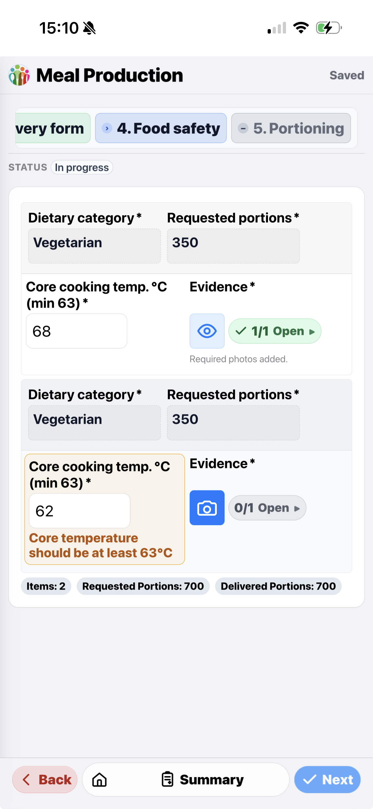
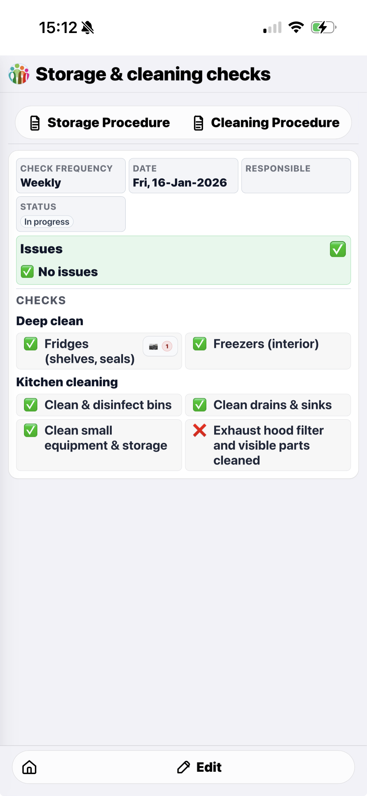

# community-kitchen

A Google Apps Script project that helps organizations digitize their processes with a professional, user-friendly web app.

## Objective

- Provide a professional, intuitive, user-friendly interface that requires no training.
- Help any organization digitize their processes, especially those without budget for expensive licenses.
- Offer a free solution that can be deployed and operated via Google Apps Script, with additional infrastructure options in the future.
- Make configuration AI-friendly via comprehensive setup instructions and a configuration contract that follows OpenAPI standards.

## Screenshots

Meal Production (Steps UI) | Recipes (Home Page) | Storage and cleaning checks (Summary View)
--- | --- | ---
 |  | 

## Features

### Core experience

- **Multi-language Support (max 3)**: Supports English/French/Dutch (Belgian Dutch) with per-form language config (enabled languages + default language). You can also disable language selection and force a single default language.
- **Dashboard Management**: Manage multiple forms from a single "Forms Dashboard" sheet.
- **Smart Updates**: Updates existing forms without breaking links or losing data.
- **Archiving**: Soft-delete questions by marking them as "Archived" in the config sheet.
- **Destination Management**: Automatically renames response tabs for better organization.
- **Custom Web App Forms**: Generate Apps Script web apps (via `doGet`) that support line items and file uploads while still writing back to your Sheets.
- **Unified Shell & Navigation**: The form shell uses a left `← Apps` back button, a centered form title, an optional title-open sidebar (Refresh / Language (optional) / Build), plus a top action bar under the header and a fixed bottom action bar that adapt per view (List/Summary/Form). You can override the Summary button label per form via `summaryButtonLabel`, and disable the sidebar per form with `"appHeader": { "sidebarEnabled": false }` while keeping a `?dev-mode=true` troubleshooting override.
- **Optional form logo metadata**: You can still attach a Drive-backed logo via dashboard JSON (`"appHeader": { "logo": "<drive file id or share URL>" }`) so launcher surfaces can reuse it as artwork metadata, even though the in-form shell no longer renders a header logo directly.
- **Configurable action bars (per form)**: Use the dashboard `"actionBars"` config to control which system buttons (Home/Create/Edit/Summary/Submit/Actions) and which custom BUTTON groups appear in the top/bottom bars per view, including order and visibility.
- **System action gates (ck-70)**: Hide/disable system actions (Submit/Summary/Edit/Create/Home/Copy) with config-driven `when` rules via `actionBars.system.gates`, including optional message dialogs.
- **Feature flags (per form)**: You can disable some UI features via the dashboard config JSON, e.g. `"summaryViewEnabled": false`, `"copyCurrentRecordEnabled": false`, `"createNewRecordEnabled": false`, `"createRecordPresetButtonsEnabled": false`, `"languageSelectorEnabled": false`, or `"listView": { "headerSortEnabled": false }` (disable header-click sorting).
- **Create/Copy UX (per form)**: Customize Create/Copy labels via `"createButtonLabel"` / `"copyCurrentRecordLabel"`, control copied data via `"copyCurrentRecordDropFields"` (blacklist; kept blank in the copied draft) or `"copyCurrentRecordProfile"` (whitelist, including nested subgroup rows), and optionally show an informational dialog after copy via `"copyCurrentRecordDialog"`.
- **App-like iOS Edit UI**: The edit view uses an iOS grouped visual style, a fixed bottom action bar (Home/Create/Summary/Submit) with safe-area padding, and supports 2-up field grids where space allows. CHOICE fields can render as segmented/radio/select/switch (auto-defaults with per-field overrides), and CHECKBOX fields with no options render as a single consent checkbox.
- **React Shell Only**: The published web app renders the React UI automatically; the legacy iframe template has been removed.

### Data, rules, and configuration

- **Field-level guarded changes (ck-47)**: Configure per-field `changeDialog` rules (top-level or line-item fields) to pause autosave and confirm edits when `changeDialog.when` matches after a change. You can add dialog `inputs` to update peer fields, parent fields, or selection-effect rows (`target.scope: "row" | "parent" | "top" | "effect"` with `effectId`), and `changeDialog.confirmUpdates` to apply literal or type-aware clear operations on confirm. On confirm, a dedup precheck runs for reject-rule keys (or `dedupMode: "always"`); on cancel/conflict, the change is reverted and autosave resumes.
  - `changeDialog.primaryAction: "cancel"` makes Cancel the primary/default action (useful when confirming a destructive change).
  - `changeDialog.cancelAction: "discardDraftAndGoHome"` makes Cancel discard the pending draft edits and navigate to Home/List.
- **Home leave guard dialog (dedup keys and/or configured fields)**: Configure `actionBars.system.home.dedupIncompleteDialog` (legacy) or `actionBars.system.home.incompleteFieldsDialog` (new) to show a confirmation dialog when users try to leave the form with incomplete required data. Use `criteria` (`dedupKeys` | `fieldIds` | `either`) and `fieldIds` for flexible field-based guards. On confirm, the app navigates Home and can delete the current persisted record first (`deleteRecordOnConfirm`, default `true`).
  - `dedupIncompleteDialog.primaryAction: "cancel"` makes Cancel the primary/default action (useful for destructive leave dialogs).
  - Set `dedupIncompleteDialog.title` to an empty string to render the dialog without a title line.
- **Form-level conditional field disable rules**: Configure `fieldDisableRules` at the form/dashboard level to make the edit view read-only when a `when` condition matches, with optional `bypassFields` to keep specific fields editable (for example, lock all fields when `DATE` is in the future except `COOK`).
  - Guided-step locks can target a single step by adding `__ckStep` in the rule condition (for example, lock only `orderInfo` when status is `Ready for Production`).
  - `when` clauses can also reference request params via `__ckRequestParam_<name>` (for example `__ckRequestParam_admin`).
  - For admin-only unlock flows, add a Summary `updateRecord` button that sets status back to an editable value (for example `In progress`) and gate its `visibility.showWhen` with `__ckRequestParam_admin`.
  - For the dedicated `ready-for-production-order-lock` rule, you can use `?unlock=<record_id>` in the web-app URL to bypass the lock for that specific record. Set `unlockStatus` on that rule to automatically switch status back to an editable value (for example `In progress`) when unlock is used.
  - `selectionEffects[].preserveManualRows: false` (data-driven effects) deletes existing manual rows in the target group when refreshing auto-generated rows.

- **Dynamic Options & Rules**: Option filtering based on another field plus cross-field validation rules (main form and line items), including non-blocking warning rules (`level: "warning"`). `when` clauses support date comparisons (`isToday`, `isInPast`, `isInFuture`) evaluated against the user's local date.
- **Line-item aware visibility**: `visibility` supports `lineItems` clauses to show/hide top-level fields or BUTTONs based on row-level conditions in line-item groups or subgroups, with optional parent-scoped matching via `parentWhen` (for example, only show an Ingredients button when a non-reheat parent row has a manual ingredient entry).
- **Localized Sorting & Tooltips**: All option lists sort alphabetically per language; options can show tooltips from data sources (with inline fallback).
- **Data source identity backfill**: Historical rows can be backfilled with missing hidden datasource identity fields (`*_SOURCE_ID`, `*_SOURCE_UPDATED_AT`) using the guarded `backfillDataSourceIds` endpoint and the local runner documented in `docs/data-source-id-backfill.md`.
- **Derived TEXT Maps**: TEXT fields (and line-item fields) can be readonly value-maps that derive their content from another field via `optionMap` (inline) or `optionMapRef` (sheet-driven).
- **Computed Fields**: `derivedValue` can auto-calculate fields (including numeric formulas with `SUM(GROUP.FIELD)` aggregates), offset DATE fields with `op: "addDays"` or `op: "addMonths"`, prefill DATE fields with today, map time-of-day into a default value, copy a default value from another field (e.g., NUMBER defaults), or compose readonly text from other fields with `op: "template"`, and keep them hidden/system-managed.
- **Default Values**: `defaultValue` can prefill fields on new records/new rows (top-level + line items) without overriding user edits. `selectionEffects.type="addLineItems"` presets can reference `$row.FIELD_ID` and `$top.FIELD_ID` to copy values into newly created rows. Selection effects also support `type: "setValue"` to update a field in the current row or top-level record (supports `$row.` / `$top.` refs and `null` to clear), `type: "setValuesFromDataSource"` to hydrate one or more target fields from a matched external record, `when` gating (visibility-style conditions, including numeric comparisons), `hideRemoveButton` (suppress Remove for effect-created rows), and `type: "deleteLineItems"` (delete linked child rows; cascade deletion prevents orphaned rows). Generated rows are filtered by the target fields' `optionFilter` allowlists (disallowed mapped values are skipped).
- **System UI strings (i18n)**: App/system copy (menus, autosave banners, expand/collapse, etc.) is stored in `src/web/systemStrings.json` with defaults for EN/FR/NL.
- **Hide labels (per field)**: Hide any field label with `ui.hideLabel: true` (top-level questions and line-item fields). By default this hides labels in both the Edit view and the native React Summary view; override Summary behavior with `ui.summaryHideLabel: true|false`.
- **Helper text (per field)**: Add localized helper text with `ui.helperText` (legacy single text + `ui.helperPlacement`) or use dual helper copy with `ui.helperTextBelowLabel` and `ui.helperTextPlaceholder` to render both below-label help and in-control placeholder text at the same time.
- **Date bounds (per DATE field)**: Constrain date entry with `ui.minDate` / `ui.maxDate`. Supported values are `today` and explicit `YYYY-MM-DD` strings. If a user types an out-of-range date, the client snaps it to the nearest allowed date and shows a short neutral notice below the field. Use `ui.dateCorrectionMessages.min` / `ui.dateCorrectionMessages.max` when a form needs custom explanatory copy for that temporary note.

### Line items and workflows

- **True Nested Line Items**: Line-item groups and subgroups can nest multiple levels (path-based addressing with wildcards), with option filters, selection effects, visibility rules (`parentWhen` ancestor scope), and totals. Full-page overlays can render a header table of parent rows with View/Edit actions and a detail body for nested rows or HTML templates.
- **Overlay detail controls**: `overlayDetail.rowActions.editPlacement` can move Edit actions into the body (HTML templates can add a button with `data-ck-action="edit"`). `overlayDetail.body.view.hideTabTargets` hides named tabs in bundled HTML templates that use `data-tab-target`/`data-tab-panel`.
- **Field-driven overlay openers**: Any question can render as a button that opens a line-item group overlay, optionally filtering header rows and overriding overlay UI per opener. Overrides honor `minRows`/`maxRows`; single-row groups can surface fields inline via `flattenFields` with placement via `flattenPlacement`. Use `hideTrashIcon` to remove the reset icon. Use `closeConfirm` to control the exit dialog when closing the overlay (simple confirm or conditional cases via `OverlayCloseConfirmConfig`, including optional `onConfirmEffects` like deleting incomplete rows and `validateOnReopen` to re-run validation and focus the first issue on return). Overlays opened this way auto-select the first row (view if available, otherwise edit), and completing all header fields auto-opens the detail panel.
- **Progressive + Table Line Items**: Mark questions with `"header": true` to pin them in the sticky header while editing, and set `LINE_ITEM_GROUP` configs to `"ui": { "mode": "progressive" }` to render line-item rows collapsed by default with an expand toggle that unlocks once configured collapsed fields are valid. Subgroups can be edited via a full-page overlay from buttons next to triggering fields (selection effects) or from subgroup fallback buttons. Line-item rows can also display config-driven per-row disclaimers (localized, template-based) that can reference `__ckRowSource`. For compact workflows (like ingredient lists), use `"ui": { "mode": "table", "tableColumns": ["ING", "QTY", "UNIT"], "tableHideUntilAnchor": true, "tableColumnWidths": { "ING": "50%", "QTY": "25%", "UNIT": "25%" }, "nonMatchWarningMode": "descriptive" }` to render a spreadsheet-like table for both groups and subgroups. Set `ui.rowSort` (for example `{ "fieldId": "ING" }`) when a table or overlay should render rows alphabetically/numerically without changing saved row order. In read-only table cells, you can append another field value in parentheses via `ui.readOnlyAppendFieldId` (optionally suppress values like `None` via `ui.readOnlyAppendHideValues`). If the group uses `"ui": { "openInOverlay": true }`, you can set `ui.closeConfirm` / `ui.closeButtonLabel` to control the exit dialog. To prevent duplicates inside a group or subgroup, add `dedupRules` such as `{ "dedupRules": [{ "fields": ["ING", "UNIT"] }] }`; custom `message` strings can include `{value}` for the first dedup field. To prevent deleting the last required row, add `removeGuard: { "minRows": 1, "message": { "en": "At least one row must remain." } }`.
- **Guided multi-step Edit View (optional)**: Configure a reusable `"steps": { "mode": "guided", ... }` object on the dashboard to render a stepper at the top of the Edit view and progressively disclose only the configured content per step. Steps can include `helpText` to show step-level guidance above the content (for example, food safety confirmation instructions). Steps can include a mix of top-level questions and line item groups (inline or full-page overlay), can scope visible row fields and subgroups, and can filter visible rows (e.g., `quantity > 0`). Use step-level `includeWhen` / `excludeWhen` to hide entire steps dynamically; hidden steps are removed from the stepper and validation flow. If you need to show all rows but only validate/advance based on a subset, use `validationRows` on the step target. Line-group step targets can also include `groupOverride` to override the underlying line-item group configuration for that step (for example, to change which totals are shown). Use `contextHeader.parts` to render a bold title line above the step body; parts can be plain field ids or objects like `{ "id": "CUSTOMER", "displayField": "FULL_NAME" }` when the step title should show a richer datasource field while the rest of the app keeps the stored compact label. Navigation defaults to forward gated by validity (`defaultForwardGate: "whenValid"`) with configurable auto-advance (default `onValid`). Add `navigation.autoAdvanceWhen` when a step should become locally complete first but should only navigate after an extra runtime condition matches (for example `status == "In production"`). When a step is blocked, validation feedback is shown inline at the field level (no step-level banner). Customize per-step labels for the primary action and Back button (`stepSubmitLabel`, `navigation.submitLabel`, `backButtonLabel`, `navigation.backLabel`, `showBackButton`), and add `navigation.milestoneAction` when a non-final step must trigger configured follow-up actions before continuing. Milestone actions can ensure a draft record id exists, choose whether to wait for uploads only or for uploads plus autosave (`waitForQueue`), validate through the current visible step range or the full form, run blocking `preActions` before optional background `backgroundActions`, require direct email dispatch with `emailDispatchMode: "direct"` when `SEND_EMAIL` must be confirmed before advancing, auto-advance to the next step, redirect to a target view after success, and show configurable confirmation / progress / acknowledgement dialogs. Follow-up batches are executed server-side in FIFO order per record, so a later `followupBatch` for the same record waits for any earlier in-flight batch to finish instead of racing status/PDF/email updates. Use `confirmationDialogCases` or `progressDialogCases` when the confirmation or blocking-overlay copy must depend on the current record values, and `generatedRecordsDialog` when the step should show the records created by follow-up submit effects before the user leaves the step. `feedbackDialog.confirmAction` / `feedbackDialog.cancelAction` can run another step's configured milestone with `{ "type": "guidedStepMilestone", "stepId": "..." }` or invoke the same flow as the action bar submit button with `{ "type": "formSubmit" }`, which keeps shortcut dialog buttons config-driven. `generatedRecordsDialog.itemTemplate` supports placeholder fallbacks like `{{A || B}}` plus formatters such as `label`, `appendField`, `pluralize`, and `date`, so use-case-specific downstream record copy stays in config. `actions` remains as a legacy alias for `backgroundActions`, and `waitForBackgroundSaves` remains as a legacy alias for `waitForQueue: "all"`. Render step content as read-only labels via `renderAsLabel` (top-level targets) and `readOnlyFields` or per-field `{ id, renderAsLabel: true }` entries (line item + subgroup step fields). Row-flow output segments can set `layout: "block"` to start a new full-width line inside the row summary while preserving newline-separated text, they may intentionally reference hidden helper / derived fields for display-only summaries, and list-formatted segments can set `format.sort: "alphabetical"` when the rendered values should be sorted before display. The feature exposes virtual fields like `__ckStepValid_<STEP_ID>` / `__ckStepComplete_<STEP_ID>` / `__ckStepMaxValidIndex` and the active step id as `__ckStep` (or your configured `steps.stateFields.prefix`) so `visibility`/`validationRules`/`rowDisclaimer` can be scoped by step using compound `when` clauses (`all`/`any`/`not`). Datasource-backed visibility can also reference `__ckDataSourceCount.<DATA_SOURCE_ID>`.
  - Optional: set `navigation.backgroundUtilisationSyncOnAdvance: false` on a step when tapping `Next` should not queue the generic background `applyBankUtilisationPlan` pass. Use this for flows like `Order -> Leftover bank`, where step entry should only refresh bank via datasource fetches/heartbeats, while utilisation releases are already handled by managed-row removal detection and utilisation writes should wait for actual user leftover selections.
- **Progressive line items UX (steps)**: For progressive LINE_ITEM_GROUPs, you can set `collapsedFieldsInHeader: true` on a step's `lineGroup` target to render the configured `lineItemConfig.ui.collapsedFields` in the row header and disable the row toggle/pill (rows are always expanded). If the step only includes those collapsed fields, the row body is hidden and any `rowDisclaimer` is shown as a footer.
- **Progressive row header summary**: Set `lineItemConfig.ui.rowHeaderSummaryTemplate` to show a single compact header line for each progressive row, for example `{MEAL_TYPE} | {ORD_QTY}`. This is useful when a guided step should show only a subgroup table in the body while keeping the parent row summary visible in both collapsed and expanded states.
- **Compact sentence rows for line items**: For guided/mobile-heavy line-item flows, set `lineItemConfig.ui.compactRows: true` and drive the first line, inline sentence controls, supporting detail text, and row actions via `compactHeadlineRows`, `compactDetailRows`, `compactSentenceRows`, and `compactActions`. Headline/detail parts can read either local hydrated fields or datasource payloads, including nested list summaries via `type: "sourceListSummary"` with optional `sort: "alphabetical"`, so compact rows stay config-driven instead of depending on hidden intermediary fields. For datasource-backed allocation UIs that must render the shared source row once and allocate into many target rows, set the datasource-row config `presentation: "sourceFirstAllocations"` with optional `presentationWhen`, `hideParentRowsWhenPresentationActive`, `allocationLabelFieldId`, `sourceMatchFieldIds` (fallback match columns, checked in order), `ui.emptyStateMessage` when filtering leaves no compatible source rows, and `ui.noSourceRowsMessage` when the datasource itself has no rows. Add `ui.allocationLabelVisibility: "always"` when the allocation label must remain visible even if only one compatible parent row is currently shown, or `ui.sourceFirstRowSort: "alphabetical"` when the rendered source rows should sort by their resolved headline text instead of datasource order.
- **Datasource backfill for legacy rows**: Form-backed data sources can declare `dataSource.backfill` to repair legacy rows that are missing derived fields. The backfill is config-driven: it points at source form/record/row fields, resolves configured root/nested scopes, and fills only the target fields that are still empty. Use this for migration-safe datasource recovery rather than hardcoding form-specific repair logic in services.
- **Transient selector rows**: Set `lineItemConfig.ui.persistRows: false` on a line-item group or subgroup when it should behave as UI-only state. Transient rows are rendered normally but are not persisted into draft/final record payloads and are not reloaded from existing record values. This is useful for datasource-backed selector rows whose authoritative saved output is generated into another group.
- **Immediate downstream row regeneration**: `selectionEffects.addLineItems` now supports explicit `replaceExistingByEffectId: true`, which lets compact-row inputs regenerate a single downstream line item immediately without appending duplicates.
- **Field-payload line-item hydration**: `selectionEffects.type: "addLineItemsFromFieldPayload"` can hydrate a target line-item group from a serialized payload already present on the current row, which is useful when a selector should read from a shared bank record and then materialize normalized internal rows.
- **Sibling subgroup regeneration**: When a `selectionEffects` rule runs inside a subgroup row, `groupId: "<SUBGROUP_ID>"` resolves relative to the same parent row first. This allows one subgroup to immediately regenerate a sibling subgroup without hardcoding runtime keys.
- **Row flow (steps)**: Step-scoped `rowFlow` renders a per-row output line + a single active prompt. Output segments can reference child rows, render per-segment action icons via `editAction` or `editActions`, and `output.actions` can pin row actions (inline/below or once per group via `output.actionsScope`/per-action `scope`). Prompts can embed selector overlays, and actions can edit values/delete rows (`deleteRow`)/add rows/close overlays/open overlays; use per-action `enabledWhen` / `disabledWhen` to keep an action visible but disabled until the row context is ready. Prompts can override labels (`input.label`) with `labelLayout: "stacked" | "inline" | "hidden"`, control action placement via `actionsLayout`, and auto-trigger actions once complete (`onCompleteActions`). Row-flow output segments also support `type: "text"` for static inline copy, `type: "spacer"` to push later inline segments toward the row end, `format.unique` for deduped list summaries, `layout: "block"` for multiline summaries, hidden helper / derived field references for display-only summaries, and `renderAs: "control" + controlStyle: "compact"` for sentence-style inline controls, including compact boolean checkboxes. Row-flow open-overlay effects accept the same options as field overlay openers (row filters, group overrides, flattening, rowFlow overrides, `hideCloseButton`, `closeButtonLabel`, `closeConfirm`) plus per-action `overlayContextHeader` overrides and `overlayHelperText` for helper copy that renders below the overlay list; `rowFlow.overlayContextHeader.fields` provides a default context line in overlays opened from row flow actions.
- **Selection effects IDs (rules)**: Any `selectionEffects[]` rule can include an `id`. Auto-created rows will be tagged with `__ckSelectionEffectId = "<id>"` so row-level `visibility`, `validationRules`, and `rowDisclaimer` templates can reference the originating rule. When selection effects create rows from inside another line-item row, generated rows are also tagged with `__ckParentGroupId` + `__ckParentRowId` so `deleteLineItems` can remove linked child rows and row deletions cascade (no orphaned rows).
- **Group behavior (optional)**: Auto-collapse completed group sections (and optionally open the next incomplete section + auto-scroll on expand) via dashboard JSON: `"groupBehavior": { "autoCollapseOnComplete": true, ... }`.
- **Page sections (visual guidance)**: In the Edit (form) view, you can optionally wrap multiple group cards under a shared section header via `group.pageSection` (section title + optional right-side info text). This is purely visual and does not affect validation or submissions.

### Templates, outputs, and reporting

- **Consolidated Outputs**: PDF templates support consolidated aggregations + calculations, including subgroup paths (e.g., `{{CONSOLIDATED(MP_DISHES.INGREDIENTS.ALLERGEN)}}`), row-scoped subgroup consolidation via `{{CONSOLIDATED_ROW(GROUP.SUBGROUP.FIELD)}}`, row/item counts via `{{COUNT(...)}}` / `{{GROUP.SUBGROUP.__COUNT}}`, sums via `{{SUM(...)}}`, and row filtering in tables via `{{EXCLUDE_WHEN(...)}}` or visibility-style `{{EXCLUDE_WHEN_WHEN(...)}}`. Line-item template contexts also expose system pseudo-fields `{{GROUP.__ROWINDEX}}` and `{{GROUP.__ROWID}}`, and HTML repeat tables can reference deeper subgroups even when the table already repeats a parent subgroup.
- **Conditional templates (reports + emails)**: `templateId` / `pdfTemplateId` / `emailTemplateId` can be a string, a language map, or a `cases` selector that picks a template based on record field values (first match wins; supports per-language template IDs per case).
- **Custom BUTTON fields**: Add BUTTON questions for Doc template PDF previews (`action: "renderDocTemplate"`; opens a new tab and navigates it directly to the generated PDF blob), Markdown template previews (`action: "renderMarkdownTemplate"`), HTML template previews (`action: "renderHtmlTemplate"`), open a saved URL from a field (`action: "openUrlField"`), create a new record with preset values (`action: "createRecordPreset"`), or mutate the current record (`action: "updateRecord"`). For PDF buttons you can optionally set `button.loadingLabel` to customize the "Generating..." copy. Markdown/HTML render buttons cache successful browser render results; set `button.cacheScope: "template"` only for static templates so repeat opens reuse one cache entry across records/draft changes. `openUrlField` buttons can also set `disableWhenValueMissing: true` to stay visible but disabled until the target URL exists. `updateRecord` buttons can now also declare a reusable `dependencyGuard` that previews impacted downstream records, shows a configurable dialog only when matches exist, and applies configured downstream mutations (including line-item field clears and subgroup clears) before saving the current record. Buttons can be placed inline (`form`), in the edit Summary menu (`formSummaryMenu`), in the Summary bottom bar (`summaryBar`), in the top action bar under the header (all views: `topBar` or per view: `topBarList` / `topBarForm` / `topBarSummary`), in the List bottom bar (`listBar`), or as a template-only action (`htmlTemplate`) invoked from bundled HTML via `data-ck-action`. HTML templates can come from a Drive file id or a bundled key like `bundle:checklist_am.summary.html` (embedded from `/docs/templates` at build time and rendered client-side; may call `fetchDataSource` when projection placeholders like `{{FIELD.PROJ}}` are present). Security: Drive-sourced HTML templates must not include `<script>` tags; dynamic behavior should be implemented in bundled templates. HTML templates can pass runtime top-level value patches to `updateRecord` buttons with `data-ck-action-value-field` plus `data-ck-action-value-source`, and can include a clickable icon placeholder `{{FILES_ICON(FIELD_ID)}}` to open the Photos overlay in read-only mode.
- **Template caching (HTML/Markdown)**: HTML/Markdown templates are cached in Apps Script `CacheService` for faster backend reads, and successful browser render results are cached under the app/server cache version. Browser cache keys are record-scoped by default; static Markdown/HTML button templates can set `button.cacheScope: "template"` to avoid repeat server calls when the same top-bar/help content is opened across records or draft changes. You can force-refresh backend template content via Create/Update All Forms (template cache epoch), and optionally configure per-form template cache TTL (seconds) via the dashboard JSON `templateCacheTtlSeconds` (max 6h due to Apps Script limits).
- **React Summary View**: The Summary view is a fast React report: top-level fields render as cards, line-item groups render as mobile-friendly tables, and subgroups render as collapsible tables (collapsed by default). By default, Summary only shows fields that are visible in the Form view (respects `visibility`); override per field with `ui.summaryVisibility: "always" | "never"`. If a PDF was generated on submission, its `pdfUrl` is shown as a link. You can disable Summary per-form via the dashboard config: `"summaryViewEnabled": false`, or fully replace it with an HTML template via `"summaryHtmlTemplateId"` (Drive file id or a bundled `bundle:<filename>` key).
  - **Paragraph formatting**: PARAGRAPH values preserve line breaks in Summary (multi-line text renders with the same spacing as entered).
  - **Textarea comfort**: Increase edit-view textarea height with `ui.paragraphRows` (default 4).

### Reliability and scale

- **Record versioning + indexing (scale)**: Destination tabs include a server-owned `Data Version` column and the app maintains a hidden per-tab index sheet (`__CK_INDEX__...`) for fast record id -> row lookups and indexed dedup (no full-sheet scans). The React client validates cached records via `getRecordVersion`, can run lightweight background freshness checks for open records (`recordFreshness`), and auto-synchronizes the latest snapshot when the server version changes. Draft autosave + submit use optimistic locking (client version must match server version) to prevent overwriting changes made by other users.
- **Separate audit sheet logging**: You can enable `auditLogging` in dashboard JSON to write change rows to a dedicated audit tab. Each row stores `fieldPath`, `beforeValue`, `afterValue`, `date_time`, `auditType`, and `deviceInfo`. You can scope change logs to specific statuses (`auditLogging.statuses`) and trigger full-record snapshots with `auditLogging.snapshotButtons` (stores full JSON in `snapshot`).
- **Drag & Drop Uploads**: React forms ship with keyboard-accessible dropzones that enforce file caps, surface total size + remaining slots, and expose per-file remove/clear controls with live announcements.

## Architecture

The project is refactored into modular components:

- **`src/index.ts`**: Entry point for Apps Script triggers and menu items.
- **`src/config/Dashboard.ts`**: Handles reading and writing to the central dashboard.
- **`src/config/ConfigSheet.ts`**: Parses individual form configuration sheets.
- **`src/services/FormGenerator.ts`**: Orchestrates the generation process.
- **`src/services/FormBuilder.ts`**: Handles the low-level Google Form manipulation.
- **`src/services/WebFormService.ts`**: Renders custom web app forms (with line items and file uploads) and writes submissions directly into the destination tabs.

## Server-Side Caching & Prefill

The custom web app now ships with a multi-layer cache to keep list views and record prefill snappy while staying inside Apps Script limits:

- **Script Cache (5‑minute TTL)** – Each page of `fetchSubmissions` results and every hydrated record is serialized into `CacheService.getScriptCache()`. Cache keys are scoped by form key, page size/token, and a per-sheet etag so stale rows are automatically discarded after edits.
- **Document Properties ETags (fast reads)** – Every destination tab maintains a lightweight “etag” (version string) in `PropertiesService.getDocumentProperties()`. Reads reuse the stored etag to avoid expensive full-column hashing; writes (including `saveSubmissionWithId` and follow-up status updates) bump the etag, invalidating Script Cache entries. If the destination tab grows (row/column counts change), the etag is auto-bumped as well.
- **Record Data Version (per row)** – Each destination row has a monotonic `Data Version` integer. The client can call `getRecordVersion(formKey, recordId)` to validate cached records without downloading full record payloads.
- **Batch Fetch Endpoint** – `fetchSubmissionsBatch(formKey, projection?, pageSize?, pageToken?, includePageRecords?, recordIds?)` returns `{ list, records }`. `list` mirrors `fetchSubmissions`, while `records` can optionally pre-hydrate the page’s records (plus any explicit `recordIds`) when you want to open a row without an extra round trip.
- **Client Row Cache** – The React client keeps list rows and any hydrated records in memory. Selecting a row reuses the cached payload when available; otherwise it fetches the full record with `fetchSubmissionById`.

### When to refresh or invalidate

Nothing extra is required in day-to-day use: submitting a form, editing a row, or changing the destination tab automatically triggers a new etag and clears the corresponding Script Cache entries. If you need to force a reset after manual sheet edits you can:

- Temporarily change data in the destination tab (e.g., add + remove a dummy row) to generate a fresh etag.
- Prefer: install triggers via **Community Kitchen → Install Triggers (Options + Response indexing + Daily analytics + Daily lifecycle)** so manual edits automatically bump `Data Version` + etags, daily analytics reconciliation runs, and config-driven lifecycle status rules are evaluated at 2am.
- For existing datasets, run **Community Kitchen → Rebuild Indexes (Data Version + Dedup)** to backfill index sheets and dedup signatures.
- Delete the stored fingerprints via the Apps Script console: `PropertiesService.getDocumentProperties().deleteAllProperties();`.
- Run **Community Kitchen → Create/Update All Forms** in the Google Sheet. The generator now bumps the cache version in `PropertiesService`, which invalidates every Script Cache namespace immediately after forms are regenerated.
- Redeploy a rebuilt `dist/Code.js` bundle (new cache prefixes) or wait for the ~5 minute CacheService TTL to expire naturally.

## Debug Logging

Verbose logging can be toggled per deployment via a script property (`CK_DEBUG`). Add the following helper functions to the Apps Script editor (e.g., in `Code.gs`) and run them as needed:

```js
function enableDebugLogs() {
  PropertiesService.getScriptProperties().setProperty('CK_DEBUG', '1');
  Logger.log('CK_DEBUG enabled');
}

function disableDebugLogs() {
  PropertiesService.getScriptProperties().deleteProperty('CK_DEBUG');
  Logger.log('CK_DEBUG disabled');
}
```

When enabled, server-side debug statements (e.g., `WebFormService` diagnostics) stream to both `Logger.log` and the execution log, making it easier to trace dashboard loading, form rendering, and data fetches. Disable logging before final deployments to avoid noisy logs.

Enabling `CK_DEBUG` also flips `window.__WEB_FORM_DEBUG__` on the web client, so the React bundle prints `[ReactForm] …` events (uploads, submit lifecycle, follow-up actions) in DevTools alongside the inline status banner.

To export the full form configuration as a single JSON document for diagnostics or LLM context, use one of:
- Apps Script: `fetchFormConfig(formKey)` (returns the full export object).
- Web app URL: append `?config=1` (returns JSON for the selected form).
- DevTools: run `window.__CK_EXPORT_FORM_CONFIG__()` to fetch and store JSON in `window.__CK_FORM_CONFIG_JSON__` (pass `{ logJson: true }` to print it).

## Environment tag (optional)

To show a small environment label in the web app header (for example, to distinguish staging vs prod), set a Script Property:

- Key: `CK_UI_ENV_TAG`
- Value: the label you want to display (e.g., `Staging`)

After saving the property in the Apps Script project settings, refresh the web app to see the tag.

### Bundled config exports (sheetless override)

You can bundle a config export into the Apps Script build so the app reads config from JSON instead of sheets:

1. Export a config file into the repo:
   ```bash
   npm run export:config -- --url "<appScriptWebAppUrl>" --form "Config: Meal Production"
   # optional env-aware export
   npm run export:config -- --url "<appScriptWebAppUrl>" --form "Config: Meal Production" --env staging
   ```
   This saves a JSON export under `docs/config/exports/` (file name derived from `formKey`).
   - Alternative: set `CK_APP_URL` and `CK_FORM_KEY` in `.env` (see `.env.example`) and run `npm run export:config`.
   - To keep environment bundles separate, set `CK_CONFIG_ENV=staging` (or `--env staging`) to write to `docs/config/exports/staging/`.
2. Build as usual:
   ```bash
   npm run build
   ```
   The build embeds `docs/config/exports/*.json` into the Apps Script bundle (or `docs/config/exports/<env>/*.json` when `CK_CONFIG_ENV` is set).
3. Deploy `dist/Code.js` to Apps Script. When a bundled export is present, the server logs `configSource: "bundled"` and the app no longer needs to read dashboard/config sheets for that form.

### Optional: Apps Script CI/CD (clasp)

This repo includes a deploy workflow using `clasp`, so you can deploy from GitHub Actions or locally:

- Local:
  - Copy `.clasp.json.example` → `.clasp.json` and set your scriptId.
  - Run `npx clasp login` once to create `~/.clasprc.json`.
  - Deploy with `npm run deploy:apps-script`.
  - Optional: store deploy env vars in `.env.deploy` (see `.env.deploy.example`) to avoid exporting them each time.
- GitHub Actions:
  - Add secrets: `CLASP_SCRIPT_ID` and `CLASP_TOKEN` (the contents of `~/.clasprc.json`).
  - Optionally add `CLASP_DEPLOYMENT_ID` to update a specific web app deployment.
  - Run the **Deploy Apps Script** workflow (manual trigger).

### Optional: Firebase Hosting for React JS assets

The default build still embeds the React web bundle inside Apps Script. For deployments that are approaching Apps Script size limits, you can move only the static JS assets to Firebase Hosting while keeping Apps Script as the web app shell and data server.

Target architecture:

- Apps Script serves the initial HTML shell, boot globals, and all `google.script.run` endpoints.
- Firebase Hosting serves immutable hashed files under `dist/firebase-hosting/assets/`.
- The Apps Script shell points at the hosted JS when `CK_WEB_ASSET_MODE=external` and `CK_WEB_ASSET_BASE_URL` is configured.
- If external mode is not configured, the shell falls back to the existing Apps Script `?bundle=react` route.

Setup and deploy:

```bash
cp .env.firebase.example .env.firebase.staging
# edit FIREBASE_PROJECT_ID (or reuse GCP_PROJECT_ID), FIREBASE_HOSTING_SITE_ID, and CK_WEB_ASSET_BASE_URL
DEPLOY_ENV=staging npm run firebase:setup
DEPLOY_ENV=staging npm run deploy:firebase-hosting
DEPLOY_ENV=staging npm run deploy:apps-script
```

The Firebase setup account must be able to add Firebase to the GCP project and create Hosting sites. If an owner/admin already enabled Firebase, rerun setup with `SKIP_FIREBASE_PROJECT_ENABLE=1`.

For a combined asset + Apps Script deployment, use:

```bash
DEPLOY_ENV=staging npm run deploy:firebase-web-app
```

The Firebase setup writes a local `.firebaserc` target mapping, which is intentionally ignored because the site id is environment-specific. To roll back while keeping `.env.firebase` in place, run `CK_WEB_ASSET_MODE_OVERRIDE=embedded npm run deploy:apps-script`; otherwise set `CK_WEB_ASSET_MODE=embedded` or remove the Firebase env file, then redeploy Apps Script.

### Optional: Cloud Run multi-backend API bootstrap

The project includes optional backend-preparation scripts for a Cloud Run API, using env-specific files in the same style as the existing `clasp` flow.

Important positioning:

- `apps-script-only` remains the safe default and does not require Cloud Run
- `hybrid-drive-api` is the first Cloud Run validation mode; it reads existing Google Sheets data and Drive file metadata through Google APIs
- `hybrid-firestore-drive` is the later mode where Firestore stores operational data/projections while Drive remains available for templates, uploads, images, and resources

1. Install Google Cloud CLI and authenticate:
   ```bash
   gcloud auth login
   gcloud auth application-default login
   ```
2. Copy `.env.gcp.example` to `.env.gcp.<env>` (for example `.env.gcp.staging`, `.env.gcp.stage-two`, or `.env.gcp.prod`) and fill in:
   - `GCP_PROJECT_ID`
   - `GCP_REGION`
   - `GCP_FIRESTORE_DATABASE`
   - `GCP_FIRESTORE_LOCATION`
   - `GCP_CLOUD_RUN_SERVICE`
   - `GCP_RUNTIME_SERVICE_ACCOUNT_ID`
   - `CK_DATA_BACKEND=drive`
   - `CK_FILE_BACKEND=drive`
   - optional `CK_DEFAULT_SPREADSHEET_ID` when data source ids refer to tabs in one default spreadsheet instead of `<spreadsheetId>::<tabName>`
3. Provision the backend resources:
   ```bash
   DEPLOY_ENV=staging npm run gcp:setup
   ```
   This enables the required Cloud Run, Firestore, Sheets API, Drive API, Gmail API, and IAM Credentials API services; creates the Firestore database if needed; creates the Cloud Run runtime service account; and grants Firestore/signing access to that service account. For `hybrid-drive-api`, also share the required spreadsheets, template folders, upload/resource folders, and image/resource folders with the Cloud Run runtime service account. Viewer access is enough for read validation; Sheets-backed Cloud Run writes require editor access on the target spreadsheet. Drive uploads through a service account require a Shared Drive upload folder with contributor/editor access, or else uploads should remain routed to Apps Script.
4. Deploy the optional Cloud Run API service:
   ```bash
   DEPLOY_ENV=staging npm run deploy:cloud-run
   ```
   When `GCP_ALLOW_UNAUTHENTICATED=1`, the deploy script uses `--no-invoker-iam-check` so public access still works in Google Workspace environments that block `allUsers` IAM bindings.
5. Enable hybrid routing in the Apps Script web app by setting script properties:
   - `CK_BACKEND_MODE=hybrid`
   - `CK_API_BASE_URL=<cloud-run-service-url>`
   - `CK_HTTP_FUNCTIONS=fetchBootstrapContext,fetchBootstrapContextWithOptions,fetchHomeBootstrap,fetchFormConfig,fetchFormCatalog,fetchAnalyticsDashboard,queueAnalyticsPipelineRun,fetchSubmissions,fetchSubmissionsBatch,fetchSubmissionsSortedBatch,fetchSubmissionById,fetchSubmissionByRowNumber,fetchSummaryRecord,fetchSubmissionsByRowNumbers,getRecordVersion,fetchDataSource,saveSubmissionWithId,uploadFiles,prefetchTemplates,renderHtmlTemplate,renderMarkdownTemplate,renderInlineHtmlTemplate,renderSummaryHtmlTemplate,renderDocTemplate,renderDocTemplatePdfPreview,renderDocTemplateHtml,renderSubmissionReportHtml,trashPreviewArtifact,previewUpdateRecordDependencies,applyUpdateRecordWithDependencies,upsertBankUtilisation,applyBankUtilisationPlan,syncGuidedStepUtilisationDraft,triggerFollowupAction,triggerFollowupActions`
   - `CK_DATA_BACKEND=drive`
   - `CK_FILE_BACKEND=drive`
   Leave these properties unset, or set `CK_BACKEND_MODE=appsScript`, to keep Apps Script-only transport.
6. Create or update Cloud Scheduler jobs after Cloud Run is deployed:
   ```bash
   DEPLOY_ENV=staging npm run deploy:cloud-scheduler
   ```
   This requires `CK_SCHEDULER_SECRET` in the GCP env file. The default jobs process queued analytics exports every 5 minutes, run analytics recompute at 23:00, and run lifecycle recompute at 02:00 in `CK_TIMEZONE` / `Europe/Brussels`.
7. Check the configured backend state at any time:
   ```bash
   DEPLOY_ENV=staging npm run gcp:status
   ```

The service lives in `cloud-run/api/` and exposes `/`, `/status`, the JSON RPC endpoint `POST /api/rpc`, and scheduler endpoints under `POST /api/jobs/<jobName>`. Implemented RPC functions include bundled form config/bootstrap reads, Sheets-backed list and record reads, staging-safe `checkDedupConflict`, guarded `saveSubmissionWithId` with `createRecord` / `updateRecord` submit effects, dependency guard previews/applies (`previewUpdateRecordDependencies`, `applyUpdateRecordWithDependencies`), bank utilisation upsert/apply and guided draft sync (`upsertBankUtilisation`, `applyBankUtilisationPlan`, `syncGuidedStepUtilisationDraft`), supported follow-up batches (`triggerFollowupAction`, `triggerFollowupActions`) for `CLOSE_RECORD`, bundled-HTML/Google-Doc `CREATE_PDF`, and delegated-Gmail `SEND_EMAIL`, Drive-backed `uploadFiles`, template reads/renders (`prefetchTemplates`, `renderHtmlTemplate`, `renderMarkdownTemplate`, `renderInlineHtmlTemplate`, `renderSummaryHtmlTemplate`, `fetchSummaryRecord`), PDF render/preview functions (`renderDocTemplate`, `renderDocTemplatePdfPreview`, `renderDocTemplateHtml`, `renderSubmissionReportHtml`, `trashPreviewArtifact`), analytics dashboard/snapshot reads and recompute (`fetchAnalyticsDashboard`, bootstrap `analytics`, `runDailyAnalyticsRecompute`), queued analytics XLSX exports (`queueAnalyticsPipelineRun`, `runQueuedAnalyticsPipelineJobs`), scheduled lifecycle recompute (`runDailyLifecycleRecompute`), `fetchDataSource`, and `fetchDriveFileMetadata`; unsupported RPC functions return a clear `501` response instead of falling back silently. With `CK_DATA_BACKEND=drive`, Cloud Run reads existing Google Sheet tabs directly through Google Sheets API. Guarded Cloud Run saves also maintain the aligned hidden `__CK_INDEX__...` row and configured audit rows when the service account can edit the spreadsheet. With `CK_DATA_BACKEND=firestore`, `fetchDataSource` reads the Firestore data-source collection.

`saveSubmissionWithId`, template rendering, PDF rendering, analytics dashboard reads, queued analytics exports, and `triggerFollowupAction(s)` can be routed through `CK_HTTP_FUNCTIONS` on staging once the Cloud Run service account has editor/contributor access to the affected response sheets, template files/folders, PDF output folders, analytics export folders, and data-source spreadsheets. Add `uploadFiles` only after the upload destination is a Shared Drive folder shared with the Cloud Run service account; otherwise the React client falls back upload saves to Apps Script when Drive returns the service-account storage-quota error. `SEND_EMAIL` follow-ups and queued analytics exports can run through Cloud Run when `CK_GMAIL_DELEGATED_USER` is set and the runtime service account has Workspace domain-wide delegation for `https://www.googleapis.com/auth/gmail.send`; if Gmail delegation is missing, the React client keeps Cloud Run for preceding non-email follow-up actions such as `CREATE_PDF`, then falls back only the email send to Apps Script and passes the generated PDF file id for attachment. When a milestone uses `emailDispatchMode: "direct"`, the fallback calls Apps Script `SEND_EMAIL` directly instead of accepting outbox queueing as success. Queued analytics export requests also fall back to Apps Script without Gmail delegation.

For Cloud Run email sending, authorize the runtime service account OAuth client ID in Google Admin console for `https://www.googleapis.com/auth/gmail.send`, set `CK_GMAIL_DELEGATED_USER` to the delegated mailbox, and ensure that mailbox can send as the configured `followupConfig.emailFrom` alias.

After deployment, validate the Drive-backed Cloud Run path with:

```bash
DEPLOY_ENV=staging npm run test:hybrid-drive-api -- \
  --data-source-id "<spreadsheetId>::<tabName>" \
  --drive-file-id "<driveFileId>"
```

To seed a Firestore data-source collection for API testing, use:

```bash
DEPLOY_ENV=staging node scripts/seed-firestore-data-source.js --file path/to/data-source.json
```

The JSON file should contain a `source` object with an `id` and an `items` array. Add `source.formKey` or pass `--form-key` when seeding a form-scoped data source.

### Performance measurement

The repo includes two complementary performance runners:

- `npm run perf:lighthouse -- --url="<web-app-url>" --runs=3 --output=./perf-results/lighthouse.json`
  - captures web vitals such as TTFB, FCP, LCP, and TTI
- `npm run perf:scenario -- --url="<web-app-url>" --formKey="Config: Meal Production" --runs=1 --preset=mobile-4g --output=./perf-results/scenario.json`
  - captures app-specific initial-load buckets:
    - `documentTtfbMs`
    - `documentRequestMs`
    - `serverDocumentMeasuredMs`
    - `serverDocumentGapMs`
    - `bundleLoadMs`
    - `firstPageDataLoadMs`
    - `pageUsableMs`
  - stops after the Home page initial-load path is measured; it no longer attempts record-open or submit steps
  - also captures:
  - `serverTimingSteps` from the Apps Script `doGet -> renderForm -> buildHtml` path
  - app-level Home timings such as `homeTimeToDataMs`, `homeBootstrapRpcMs`, and `listFetchRpcMs` when perf instrumentation is enabled in non-production environments

For staging diagnostics, you can also append `?timing=1` to a web-app URL, or open an `admin=true` URL, to expose `window.__CK_SERVER_TIMINGS__` in DevTools. The scenario runner now auto-adds `timing=1` when the target URL does not already include an explicit timing/admin flag.

Home page runtime strategy in the current Apps Script architecture:

- the initial Home callback now uses a lightweight summary-first payload instead of mixing list bootstrap and analytics in the same request
- the Apps Script shell now starts the first Home bootstrap RPC inline so it can overlap with bundle download and execution instead of waiting for React mount
- bundled form definitions now reuse the embedded exported definition when present, and cache fallback rebuilds when they are not
- analytics widgets that render on the list view are fetched after the first Home data is ready
- broader recent-activity hydration and record snapshot prefetching are deferred to idle/background work so they no longer block the first usable Home state

## Setup

1. **Install Dependencies**:

   ```bash
   npm install
   ```

2. **Build**:

   ```bash
   npm run build
   ```

   This generates `dist/Code.js`.
   A bundle-size guard now runs automatically after every build; it warns once the gzipped `dist/Code.js` passes ~1 MB and fails the build above ~1.2 MB so we stay within HtmlService limits.

3. **Deploy**:
   - Create a new Google Sheet.
   - Open **Extensions > Apps Script**.
   - Paste the content of `dist/Code.js`.
   - Run `setup()` to initialize the dashboard.

4. **Publish the Web App (custom forms)**:
   - In Apps Script, go to **Deploy > New deployment** and choose **Web app**.
   - Set the entry point to `doGet`.
   - Deploy and use the generated URL as your custom form link (supports line items and uploads).
   - React is the only experience; the legacy iframe UI has been removed.
   - `doGet` serves a fast React shell:
     - For bundled config exports, the form definition is embedded in the initial HTML (no bootstrap fetch needed).
     - For sheet-backed forms, the client keeps a long-lived browser cache keyed by `CK_CACHE_VERSION` and falls back to `fetchBootstrapContext` when missing/stale. `createAllForms()` bumps the version to invalidate caches.
     - Bootstrap and bundle fetches are started early in the HTML on cold-cache loads to overlap with each other when needed.

## Config Notes (LINE_ITEM_GROUP / FILE_UPLOAD)

- **New column**: `Config (JSON/REF)` in each Config sheet. Use it to store JSON or `REF:SheetName` for line items and upload settings.
- **Line items**: Set `Type` to `LINE_ITEM_GROUP` and provide a `lineItemConfig` via JSON or `REF:SheetName` pointing to a sheet with columns: ID, Type, Label EN, Label FR, Label NL, Required?, Options (EN/FR/NL). Types inside a line item can be DATE, TEXT, PARAGRAPH, NUMBER, CHOICE, CHECKBOX.
- **Line-item add modes**: `lineItemConfig.addMode` can be:
  - `overlay`: opens a multi-select overlay for the `anchorFieldId` CHOICE field and creates one row per selected value.
    - Customize the overlay copy with `addOverlay` (title, helperText, placeholder) per line-item group or via `groupOverride` on overlay openers.
  - `selectorOverlay`: replaces the section selector with a searchable multi-select list for the anchor CHOICE field (no separate Add button). Search indexes include extra columns from `optionsRef` / data sources.
    - Use `sectionSelector.placeholder` and `sectionSelector.helperText` to tune the search copy shown in the selector overlay.
  - `auto`: when the anchor field has an `optionFilter.dependsOn`, rows are auto-created/recomputed as soon as all dependencies are filled (one row per allowed anchor option). Auto-generated rows are overwritten when dependencies change, while manual rows are preserved. In progressive mode with `expandGate: "collapsedFieldsValid"`, gated/disabled rows are ignored during submit validation and required groups still need at least one enabled+valid row.
- **Line-item header controls**: In `lineItemConfig.ui`, you can hide the items pill and move the Add button:
  - `showItemPill: false` hides the items pill
  - `addButtonPlacement: "top"|"bottom"|"both"|"hidden"` controls where the Add button appears
  - `openInOverlay: true` opens the entire line-item editor in a **full-page overlay** (and renders a compact “Open” card in the main form)
  - `choiceSearchEnabled: true` enables type-to-search for CHOICE selects in that line-item group by default (override per field via `field.ui.choiceSearchEnabled`)
  - `needsAttentionMessage` overrides the default “Needs attention” helper shown when a line-item group/subgroup requires review (localized)
  - `allowRemoveAutoRows: false` hides the **Remove** button for rows marked `__ckRowSource: "auto"`
  - `saveDisabledRows: true` includes disabled progressive rows in the submitted payload (so they can appear in downstream PDFs)
- **File uploads**: Set `Type` to `FILE_UPLOAD` and provide `uploadConfig` in the Config column (JSON). Supported keys:
  - `destinationFolderId`
  - `minFiles` / `maxFiles` (submit-time validation; e.g. require 2+ photos)
  - `maxFileSizeMb` (per file; rejected in the web UI)
  - `allowedExtensions` and/or `allowedMimeTypes` (type checks happen client-side before upload)
  - `errorMessages` (optional localized overrides for upload validation text)
  - `warningMessages.maxFilesPartial` (optional localized popup shown after a successful blocking upload when only the first `maxFiles` selected files were added)
  - `helperText` (optional localized helper text shown under the upload control; falls back to system strings)
  - `waitMessages.title` / `waitMessages.saveTitle` / `waitMessages.removeSelectedTitle` / `waitMessages.save` / `waitMessages.removeSelected` (optional localized title and copy for blocking upload and remove transactions when `blockUntilSaved` is true; set a title value to `""` to hide the title line; omitted messages fall back to generic file-based system strings)
  - `linkLabel` (optional localized label template used for file links in Summary/PDF; e.g. `"Photo {n}"`)
  - `discardChangesConfirm` (optional localized confirmation shown when closing the photo overlay with unsaved add/remove changes; falls back to `files.discardChangesConfirm`)
  - `ui.variant` (optional UI variant; set to `"progressive"` to show slots + checkmarks based on `minFiles`)
  - `ui.slotIcon` (`"camera"` | `"clip"`, optional; controls the icon shown in progressive slots)
  - `blockUntilSaved` (optional boolean; when true, the UI blocks with the wait message until the upload-and-save transaction finishes)
  - `compression` (optional client-side image compression; videos are uploaded as-is — prefer enforcing `maxFileSizeMb`)
  - Upload changes are saved through the queued record mutation lane. With `blockUntilSaved: true`, the file management overlay saves each add/remove action immediately and blocks until the record contains the final Drive URLs. Without blocking, the overlay stages add/remove changes locally and sends one transaction when the user clicks **Save photos**. If a transaction fails, the field keeps the local file changes visible and shows a retry action that sends the same upload-and-save transaction again.
- **Filters**: Add `optionFilter` in the Config JSON to filter CHOICE/CHECKBOX options (works in line items too). `dependsOn` accepts a single field ID or an array for multi-field dependencies; for line items, it can also reference top-level fields. Build composite keys in `optionMap` by joining dependency values with `||`, plus a `*` fallback.  
  - If one dependency is a DATE value (for example `MP_PREP_DATE`), you can use weekday composite keys like `Distributor||Service||Sunday`. The filter also falls back to the non-date composite key (for example `Distributor||Service`) when no weekday-specific key matches.
  - Use `matchMode: "or"` to union allowed options when the dependency is multi-select; rows that don’t satisfy all selected keys are tagged with `__ckNonMatchOptions` and show warnings during editing.  
  Example (inline map): `{ "optionFilter": { "dependsOn": ["Product","Supplier"], "optionMap": { "Carrots||Local": ["Crates"], "Carrots": ["Bags","Crates"], "*": ["Bags"] } } }`  
  Example (sheet-driven map): `{ "optionFilter": { "dependsOn": "Supplier", "optionMapRef": { "ref": "REF:Supplier_Map", "keyColumn": "Supplier", "lookupColumn": "Allowed options" } } }`  
  Composite sheet keys: `{ "optionFilter": { "dependsOn": ["Product","Supplier"], "optionMapRef": { "ref": "REF:Composite_Map", "keyColumn": ["Product","Supplier"], "lookupColumn": "Allowed options" } } }`  
  Data-source filtering: `{ "optionFilter": { "dependsOn": "Dietary Applicability", "dataSourceField": "Dietary Applicability", "dataSourceDelimiter": "," } }`  
  Bypass values: `{ "optionFilter": { "dependsOn": "Dietary Applicability", "bypassValues": ["All"] } }`
  - When the key column contains multiple comma-separated values (e.g. `dietaryApplicability = "Vegan, Vegetarian, No-salt"`), set `optionMapRef.splitKey: true` so each key is treated as its own mapping entry.
- **Choice UI controls**: For `CHOICE` questions and line-item `CHOICE` fields, you can optionally set `"ui": { "control": "auto|select|radio|segmented|switch" }` in the Config JSON. `auto` chooses iOS-friendly defaults (segmented/radio/select; boolean-like non-required may render as switch). For long option lists, you can also enable type-to-search with `ui.choiceSearchEnabled: true` (or leave it omitted and the UI enables search automatically for large option sets). Search indexes include extra columns from `optionsRef`/data sources when available, so one input can match categories, allergens, suppliers, etc.
  - For `CHECKBOX` fields with options (multi-select), you can also set `"ui": { "control": "select" }` to render a native multi-select dropdown (`<select multiple>`). Consent-style CHECKBOX fields (no options) still render as a tick box.
  - Optional for the same multi-select dropdown UI: set `ui.multiSelectCheckboxSizePx` (range `16..40`) to increase checkbox hit-area size. Example: `"ui": { "control": "select", "multiSelectCheckboxSizePx": 32 }`.
- **Consent checkbox**: A `CHECKBOX` field with no options (and no `dataSource`) is treated as a consent boolean and rendered as a single checkbox; `required: true` means it must be checked to submit.
- **Section progress pill**: Collapsible `group` sections show a `completed/required` pill (required fields only) that also expands/collapses the section. Progressive `LINE_ITEM_GROUP` rows show the same on the row expand/collapse control.
- **Validation rules**: Add `validationRules` array in Config JSON. Supports `greaterThan` for strict numeric minimums, `minFieldId` / `maxFieldId` for cross-field numeric comparisons, plus `when.notEmpty` for “field is filled” checks (useful for TEXT/PARAGRAPH).  
  Example: `{ "validationRules":[ { "when": {"fieldId":"Product","equals":"Carrots"}, "then": {"fieldId":"Unit","allowed":["Crates"]}, "message":"Carrots only in crates" } ] }`  
  Example (conditional required): `{ "validationRules":[ { "when": {"fieldId":"Other details","notEmpty":true}, "then": {"fieldId":"Reason","required":true} } ] }`
  - Warning rules (non-blocking): set `"level": "warning"` and optionally control display with `"warningDisplay": "top"|"field"|"both"` and view scoping with `"warningView": "edit"|"summary"|"both"`.
- **Data-driven selection effects**: You can hydrate a line item group with rows that already exist in a data sheet. Add a `selectionEffects` entry with `type: "addLineItemsFromDataSource"` on any CHOICE / CHECKBOX question or line-item field. The form reuses cached data-source rows (or fetches the override) and, when the selected value matches, deserializes the specified column (e.g., JSON stored in `Ingredients`) into line-item presets. Mapping entries support `$row.FIELD_ID` to copy values from the originating line-item row (e.g., keep the selected recipe name on every generated ingredient), and `preset` now supports both literals and `$source.FIELD_PATH` for datasource-backed generated rows. If the triggering field is not itself the datasource key, set `lookupSourceFieldId` so regeneration always matches on a stable row field such as an bank id; use `lookupFields` for ordered id/name fallback during migration. `parentFieldMapping` can persist the matched source id/name back into the current row, and `sourceSync` (`refreshOnInit`, `forceRefresh`, `forceRefreshMaxCacheAgeMs`, `stopWhen`) keeps open records synchronized until a configured terminal status while optionally reusing very fresh prefetched master data. **Generated entries are filtered by the target fields’ `optionFilter` rules** (e.g., exclude a “Salt” ingredient row for `MEAL_TYPE = "No-salt"`). See `SetupInstructions.md` (“Data-driven selection effects”) for the end-to-end config walkthrough, multiplier options, and sample JSON.
- **External record hydration**: You can also copy fields from a selected external record into the current row or top-level form without creating child rows. Add a `selectionEffects` entry with `type: "setValuesFromDataSource"`, configure `lookupField`, and provide `fieldMapping` as `{ "TARGET_FIELD": "SOURCE_FIELD" }`. This is useful for stock/bank selectors where the user picks an item id and the form should pull recipe, status, portions, expiry, or other metadata from a shared table.
- **Paragraph disclaimers for partial matches**: For PARAGRAPH fields, add `ui.paragraphDisclaimer` to append a disclaimer section that groups `__ckNonMatchOptions` by key and lists the offending items (useful with `optionFilter.matchMode: "or"`).  
  - Defaults to a read-only footer under the textarea; set `paragraphDisclaimer.editable: true` to render it inside the textarea for editing.  
  Example: `{ "ui": { "paragraphDisclaimer": { "sourceGroupId": "ING", "title": { "en": "Pay attention to:" }, "listMessage": { "en": "For {key}, do not use: {items}." } } } }`
- **Data source status filter (optional)**: For record-like data sources that include a `status` column (e.g., sourcing options from another form’s records), you can set `dataSource.statusAllowList: ["Active"]` to only return rows whose status matches one of the allowed values (case-insensitive).
- **Datasource cache policy (optional)**: Stable lookup sources such as customers, ingredients, recipes, and other master-data tables can set `dataSource.cachePolicy: "versioned"` so the browser reuses the local datasource cache across refreshes until the app/server cache version changes. Transactional sources can leave the default short TTL or set `cachePolicy: "none"` when persistence is not appropriate.
- **Home-prefetch override for datasources (optional)**: Transactional datasources with `statusAllowList` or `backfill` are skipped by default on the home/list screen. If a datasource-backed visibility/count check must already be available before the form opens (for example `__ckDataSourceCount.Leftover Bank Data`), set `dataSource.prefetchOnHome: true` on the specific datasource config that should drive that count. Stable `versioned` datasources can also use `prefetchOnHome: true` to warm customer/recipe/ingredient lookups at session start.
- **HTML render cache**: Summary, inline, and button HTML render results are cached by form, record, payload signature, and app/server cache version. Reopening the same record/template with unchanged values can reuse the local rendered HTML after a browser refresh; changing the cache version invalidates old entries.
- **Past-record local cache (optional)**: Date-search list views automatically persist exact historical search results plus hydrated record snapshots when the searched date is before today. Repeating the same past-date search can render from local storage immediately, and opening a cached past record reuses the snapshot while the existing record version check still runs in the background when `dataVersion` is available. Use `recordLocalCache` to override the date field, max age, max entries, or to disable record snapshots per form.
- **List view UX**: The list screen supports both the existing **table** view and an optional **record list (cards)** view via `listView.view` (you can also enable a toggle to switch between them). Search supports keyword (default), optional **date search** via `listView.search.mode: "date"`, or a Gmail-like **advanced multi-field search** via `listView.search.mode: "advanced"` + `fields` (CHOICE/CHECKBOX and `status` render as dropdowns in the advanced panel). Date search returns immediate local results when the requested date is fully covered by the prefetched recent rows, and automatically falls back to a server-side exact-date query when the requested date is at or beyond the oldest prefetched boundary so older records remain reachable. You can also set `listView.search.initialValue` (for example `{ "relativeDate": "today" }`) so the visible search control is prefilled on first load. You can also limit any list view column to a specific mode via `showIn: "table"|"cards"|"both"`. Table view supports client-side sorting by clicking column headers, pagination (recent-list prefetch capped to the top 200 records after server-side sorting for Apps Script performance), optional header-row hiding via `listView.hideHeaderRow: true`, optional row-click disabling via `listView.rowClickEnabled: false` (icons/buttons remain clickable), a config-driven default row filter via `listView.defaultWhen`, and a date heading via `listView.dateHeading`. Cards and table view can both show **quick search presets** by adding BUTTON questions with `button.action: "listViewSearchPreset"`; presets can render inline or open a full overlay (`target: "overlay"`), can restrict themselves to specific modes via `showIn`, can apply shared `WhenClause` filters plus rolling past/future date windows (`dateFieldId`, `lookbackDays`, `lookaheadDays`, `includeToday`), and can render grouped overlay results via `button.overlay` (use `button.overlay.clearSearchOnClose` when closing the overlay should restore the Home search to its configured default). Use `listView.search.helperText` to add helper copy below the search control and `listView.search.presetsTitle` to add an inline label before preset buttons. Use `listView.layout.sections` when you need to reorder major Home/List blocks such as the metric, search, results, and presets without hardcoding a form-specific layout. Legend entries can include a neutral pill label via `listView.legend[].pill` (`tone`: `default`, `muted`, `strong`) and optional multi-column layout via `listView.legendColumns`.
  - Optional: set `listView.search.placeholder` to customize the search input placeholder text (set `""` to remove it), and set `listView.title: ""` to hide the list heading.
  - Recommended: use trigger-based `analytics.widgets` for Home/List KPIs and the dedicated analytics page (`?form=<...>&page=analytics`). Legacy `listView.metric` remains runtime-compatible but is deprecated.
- **Trigger-based analytics module**: Configure `analytics.widgets` to compute `aggregate`/`arithmetic`/`script` metrics server-side, persist snapshots in hidden per-form analytics sheets, and render them in List (`placements: ["listView"]`) and/or the analytics page (`placements: ["analyticsPage"]`). Recomputes run on save/edit/follow-up actions plus a daily reconciliation trigger (`runDailyAnalyticsRecompute`). You can also configure fire-and-forget `analytics.pipelines` (currently `ingredientUsageReport`) to surface date-driven export actions on the centralized analytics page; queued runs generate an `.xlsx` attachment and email it to the configured recipients. Ingredient usage exports support configured `Tbsp` to `gr` conversion, `gr` to `kg` conversion above 1000, and `EEE,dd-mmm-yyyy` report date placeholders.
- **Lifecycle status automation**: Configure `lifecycle.rules` on a form to run generic daily rules from the Apps Script trigger (`runDailyLifecycleRecompute`, installed at `2am`). Supported rules include `dateStatusTransition` (for example `available -> expired` when `LEFTOVER_EXP_DATE <= today`).
- **Utilisation-backed shared bank**: The leftover flow uses `Leftover Bank` as the authoritative source of current availability, while `Config: Leftover Utilisation` tracks row-level active / released utilisations. Choosing a bank item immediately subtracts quantity from the bank record; changing or clearing that usage gives quantity back to the same bank record.
- **Datasource-row utilisation sync**: Datasource-backed selection rows keep rendering from the bank while utilisation writes go through one atomic server endpoint. The client updates the bank datasource cache from the returned availability snapshot so other rows in the same form immediately see the refreshed free quantity without an extra list fetch.
- **Step-commit utilisation mode**: Guided leftover-selection steps can opt into `utilisation.commitMode: "step"` on a datasource row. In that mode, the UI updates availability locally first, then live-syncs a batched step utilisation plan on valid selection edits and quantity blur, replacing stale utilisations in the managed step scopes instead of issuing per-row utilisation writes while typing.
- **Datasource bootstrap waits for shared bank work**: Guided line-group step targets can opt into `dataSourceBootstrap.waitForGuidedUtilisationSync: true` when their datasource rows read shared bank that may still be updating from another step. They can also set `dataSourceBootstrap.waitForSharedDataMutations: true` so the step waits for in-flight follow-up actions that mutate the datasource's shared form keys before it starts `fetchDataSource`, preventing Leftover Bank screens from bootstrapping against stale bank.
- **Configurable utilisation conflict dialog**: Datasource-backed utilisation rows can define `utilisation.conflictDialog` so concurrency conflicts explain what happened and offer two actions: use the authoritative available quantity or cancel the attempted change. Message templates support `{itemLabel}`, `{itemId}`, `{available}`, `{unit}`, `{availableWithUnit}`, `{requested}`, and `{current}`.
- **Central landing page + admin canonicalization**: Opening the web app without `form` now renders a form-catalog landing page. Admin aliases (`?admin-true` or `?admin=1|true|yes|on`) are accepted and propagated as canonical `admin=true` in navigation links. Landing-page branding, copy, app grouping, per-card `imagePath` art, and header `logoFormKey` live in `docs/config/exports/<env>/landing_page.json`, which is embedded into the bundle at build time.
- **Centralized analytics dashboard**: Analytics is no longer surfaced inside individual form shells. The landing page can link to a single analytics dashboard whose card copy/art and widget composition are defined in `docs/config/exports/<env>/analytics_page.json`, with widgets sourced from the configured form analytics snapshots and `__CK_ANALYTICS__` sheets.
- **Line-item section selector filters**: `lineItemConfig.sectionSelector` now supports its own `optionFilter` (including sheet-driven `optionMapRef` with multi-column keys). If you set `sectionSelector.required: true`, the **Add line** button is disabled until a selector value is chosen (prevents creating empty rows in `addMode: "inline"`). Set `sectionSelector.choiceSearchEnabled: true` to always render the searchable input (search indexes include extra `optionsRef` columns). Use `sectionSelector.hideLabel: true` to hide the selector label (placeholder only).
- **Compact selector tables**: Line-item table UI now supports `ui.maxVisibleRows` to cap visible rows and make the body scrollable, plus `ui.hideRemoveColumn` to hide the trailing trash/remove column when the table is being used as a bounded selector instead of a manually managed list.
- **Inline subgroups in progressive rows**: Set `lineItemConfig.ui.inlineSubgroupsWhenExpanded: true` when a progressive row should reveal its subgroup table directly on expand instead of showing the fallback “Tap to open” subgroup pill.
- **Exclusive line-item selection**: Add `field.ui.exclusiveLineSelection` to a line-item field (typically a checkbox) when the same external item can only be selected once across sibling rows or across the same subgroup under different parent rows. The UI clears the previous selection and any configured dependent fields/subgroups automatically.
- **Portrait-only mode (optional)**: Set `"portraitOnly": true` in the dashboard config to block landscape orientation with a “rotate to portrait” message (useful on phones).
- **Option ordering (optional)**: By default, CHOICE/CHECKBOX options sort alphabetically by the localized label. Set `"optionSort": "source"` **per field** (top-level question or line-item/subgroup field config) to preserve source order (config sheet / optionFilter / data sources).
- **Read-only fields (optional)**: Set `"readOnly": true` **per field** (top-level question or line-item/subgroup field config) to prevent user edits in the Edit view. The value is still included in submissions (useful with `defaultValue`, `derivedValue`, or `createRecordPreset` buttons).
- **List view meta columns**: Control which system columns appear (e.g., Created At, Updated At, Status, PDF URL) by adding `listView.metaColumns` (or legacy `"listViewMetaColumns"`) to the dashboard JSON column. Only the fields you list are appended after the questions marked for list view, and they can be sorted by clicking the column headers.
- **Rule-based list view columns (dashboard)**: Add computed/action columns with `listView.columns` (or legacy `"listViewColumns"`) in the dashboard JSON. Use `type: "rule"` with `cases` to render an **Action** column like `Edit` / `View` / `Missing` based on any record field (including `status` and DATE fields). Each case can optionally override `openView` (Form/Summary/Button/Copy/Submit), and `openView` supports an object form `{ target, rowClick: true }` so clicking **any cell on the row** honors the same open target. For link-out columns (e.g. open `pdfUrl`), set `hrefFieldId`. Cases support compact icon-only rendering with `hideText: true`, and `cases[].actions` can render multiple inline actions in the same cell (for example view + copy side by side). You can also set `icon` (`warning|check|error|info|external|lock|edit|copy|view`) and define `listView.legend` to show a legend in the sticky bottom bar explaining icons (legend text supports basic inline Markdown like `**bold**` / `*italic*`).

- **Mutating custom buttons (re-open, quick updates, downstream clears)**: `BUTTON` questions can run `button.action: "updateRecord"` to update an existing record (draft save), optionally show a confirmation dialog, and then navigate to a target view (e.g. Summary → Form). This is the recommended way to implement a **Re-open** button for records whose status matches `statusTransitions.onClose` (typically by setting `statusTransitions.reOpened` or another non-closed value). Set `button.ensureRecordId: true` when the button can be clicked before the draft exists on the server; the client will block, wait for dedup/save, create the draft if needed, and only then apply the update. `updateRecord` also supports an optional `dependencyGuard` for reusable cross-form checks before the source update is applied. When matches are found in a target form, the app shows a configurable dialog and, on confirmation, can patch downstream top-level fields or matching line-item rows (including clearing direct child subgroups) before saving the source record. Bundled HTML templates can invoke `htmlTemplate` placement update buttons and supply a runtime scalar value patch from an input/control in the template. After the user confirms, the UI shows a **full-screen blocking overlay** (spinner + message) until the update finishes.
  - The same action supports guided lock transitions such as **Ready for Production** (`set.status = "Ready for Production"`) from an inline `form` button.
  - Inline form buttons can force accent styling with `button.tone: "primary"` (or neutral with `"secondary"`), instead of relying on label heuristics.
- **Draft autosave (optional)**: Enable background saves while editing by adding `"autoSave": { "enabled": true, "debounceMs": 2000, "status": "In progress" }` to the dashboard JSON column. Draft saves run without validation, bump `Updated At`, and write the configured `Status` (falls back to `statusTransitions.inProgress`). Records matching `statusTransitions.onClose` are read-only and do not autosave. The first time a user enters Create/Edit/Copy, the web app shows a one-time autosave explainer overlay (customize copy via `autosaveNotice.*` in `src/web/systemStrings.json`).
  - Optional decoupling: set `autoSave.enableWhenFields` to control which fields enable create-flow autosave, and set `autoSave.dedupTriggerFields` to control which fields trigger create-flow dedup prechecks.
  - Draft-save coalescing: the React app fingerprints draft payloads and collapses repeated autosave / ensure-draft / explicit draft-save requests for the same unchanged record before they call `saveSubmissionWithId`.
  - Optional dedup progress popup: set `autoSave.dedupCheckDialog` (checking/available/duplicate copy + auto-close durations) for a form-level non-dismissible dedup progress modal. Set a title value to `""` to hide the title line; set both `availableTitle` and `availableMessage` to `""` to skip the success popup after the check completes.
- **Background record freshness (optional, enabled by default)**: Add `"recordFreshness": { "enabled": true, "quietWindowMs": 30000 }` to the dashboard JSON column when you want an explicit per-form override for stale-record polling. While an existing record stays open, the app waits until the current record has had no successful record-related server activity for `quietWindowMs`, then sends a lightweight `getRecordVersion` ping. If the server version changed and there is no local record mutation in flight, the app reloads the latest snapshot automatically and shows a sync notice asking the user to review the step again. `recordFreshness.dataSourceWatches` can also refresh guided-step datasource rows in the background with the same quiet-window model, without triggering visible loading notices; when refreshed rows change, the app updates the cached datasource in place and can show a configurable review dialog.
- **Dedup key change delete (optional)**: For edit flows where dedup key fields should not mutate the same record identity, set `"dedupDeleteOnKeyChange": true` in the dashboard JSON column. When enabled, changing any top-level field used by a reject dedup rule removes the current record immediately (after confirm/blur + selection effects). From there, normal create-flow dedup checks and autosave behavior apply.
- **Follow-up actions**: After submitting, the app automatically runs the configured actions (`Create PDF`, `Send PDF via email`, `Close record`). Add JSON to the “Follow-up Config (JSON)” column on the *Forms Dashboard* to point at template IDs, recipients, target status values (including `statusTransitions.inProgress` / `reOpened`), optional `pdfFileNameFieldId` for naming generated PDFs, and optional `submitEffects` for shared-table writes such as creating or updating downstream bank records after the source record saves. `createRecord` and `updateRecord` submit effects can fan out over source line-item rows via `forEachLineItem`, with template access to `{{row.FIELD_ID}}`, `{{parent.FIELD_ID}}`, and `{{lineItem.index}}`. Submit-effect values can also use object-valued computed helpers such as `firstNonEmpty`, `ifPresent`, `filterCollection`, `flattenCollection`, and `lookupSetIntersection` when downstream fields must be derived from nested line-item payloads. For idempotent shared-table writes, set `recordId` so repeated saves update the same downstream record instead of creating duplicates; `recordId` is required for `updateRecord`. Optional `id` values let milestone dialogs target specific submit effects, and optional `sourceLink` metadata lets later dialogs/templates recover the downstream records created from the current source record. The current Meal Production implementation uses this pattern to capture portioning leftovers into the shared `Leftover Bank` table, including config-driven fields such as storage mode and resolved expiration date, while quantity utilisations during `2. Leftover` are handled separately through the utilisation utilisation + bank aggregate fields. See `SetupInstructions.md` for the full schema plus template guidance. After the user confirms submit, the UI shows a **full-screen blocking overlay** (spinner + message) until submission + follow-up finish.
- **Submit confirmation (optional)**: When users tap **Submit**, the app shows a Confirm/Cancel overlay (with a close `X`). You can customize the title (`submissionConfirmationTitle`), message (`submissionConfirmationMessage`), and the confirm/cancel button labels (`submissionConfirmationConfirmLabel`, `submissionConfirmationCancelLabel`) per language via dashboard JSON (falls back to system strings when omitted). The message supports record placeholders like `{COOK}` / `{DATE}` (or `{{COOK}}` / `{{DATE}}`).
- **Submit-time background follow-up (optional)**: Configure `submissionAfterSubmit` when some follow-up actions must complete before navigation (for example `CLOSE_RECORD`) while slower actions continue in the background after the user has already been redirected. The reusable config supports `preActions`, `backgroundActions`, `waitForQueue`, `navigateTo`, conditional confirmation copy (`confirmationDialogCases` with `confirmationDialog` fallback), conditional blocking-overlay copy (`progressDialogCases` with `progressDialog` fallback), optional `generatedRecordsDialog`, and a configurable `feedbackDialog`. Set a configured dialog `title` value to `""` when the title line should be hidden instead of using the fallback title. `generatedRecordsDialog.itemTemplate` supports placeholder fallbacks like `{{A || B}}` plus formatters such as `label`, `appendField`, `pluralize`, and `date`, so downstream-record dialogs do not need form-specific React logic. Follow-up batches are serialized per record on the server, so a final-submit `CLOSE_RECORD` waits behind any earlier in-flight PDF/email batch for the same record instead of running concurrently. Batches now fail fast: once one action fails, later actions in the same batch are skipped instead of running against a partially failed state. Utilisation operations also retry transient transaction-lock and record-lock contention before surfacing the error. Use `waitForQueue: "uploadsOnly"` when final submit should not wait for plain autosave.
- **Record mutation serialization + no-op saves**: Record writes now run through a per-record server lane, so same-record draft saves, final saves, dependency updates, and submit-effect record writes wait their turn instead of racing. When an update would not change any non-system fields, the server returns `operation: "noop"` and skips `Updated At` / `Data Version` bumps, audit rows, and home/analytics cache refreshes.
- **Dedup dialog copy (optional)**: When dedup rules block a record, the app shows a duplicate-record dialog with the dedup key values. Customize the title, intro/outro lines, and button labels via dashboard JSON `dedupDialog` (localized). Use `cancelLabel` for the list-view cancel action when a duplicate is detected before opening the form. The dialog body always injects the dedup key labels + values between the intro and outro.
- **Submit button label (optional)**: Override the Submit button label per language via dashboard JSON `submitButtonLabel` (falls back to system strings when omitted).
- **Ordered submit validation (optional)**: Enable `submitValidation.enforceFieldOrder` to require required fields to be completed in order, disable Submit until the form is valid, and (in guided steps) keep **Next** enabled once the step forward gate is satisfied. Use `submitValidation.hideSubmitTopErrorMessage: true` to hide the top submit-error banner while keeping inline errors. You can also customize the top error banner with `submitValidation.submitTopErrorMessage` (localized; overrides system key `validation.fixErrors` for that form), and the line-item group “Needs attention” helper with `submitValidation.lineItemGroupNeedsAttentionMessage` (localized).
- **Language-aware templates & dynamic recipients**: Follow-up configs now accept per-language `pdfTemplateId` / `emailTemplateId` maps and recipient entries that look up emails via data sources (e.g., find the distributor row in “Distributor Data” and use its `email` column). You can optionally set `emailFrom` / `emailFromName` to control the sender (must be the script owner or a configured Gmail alias). The runtime picks the correct template for the submission’s language and expands placeholders before generating / emailing PDFs, including `emailCc` / `emailBcc` recipient lists when you need extra copies.
- **Auto-increment IDs**: Any `TEXT` field can be tagged with `"autoIncrement": { "prefix": "MP-AA", "padLength": 6 }` in its Config JSON. When the user leaves that field blank, Apps Script generates sequential IDs (e.g., `MP-AA000001`) and stores the counter in script properties so numbers stay unique across sessions. Set `padLength: 0` for variable-width ids like `MI-1`, `MI-2`, `MI-10`. For shared tables you can also partition the prefix by another field value with `prefixByValue`, for example `Multi-ingredient -> MI-` and `Single-ingredient -> SI-`.
- **Template-friendly placeholders**: PDF/email templates understand **ID-based** placeholders like `{{FIELD_ID}}` (recommended) and nested values such as `{{MP_DISTRIBUTOR.Address_Line_1}}` (taken from the data source row that provided the selected option). Line-item rows can be templated inside tables—create a row with placeholders like `{{MP_INGREDIENTS_LI.ING}}` and the service will duplicate the row for every line item. Use `{{CONSOLIDATED(MP_INGREDIENTS_LI.ALLERGEN)}}` to list the unique allergen values collected across the group.
  - Legacy support: slug-of-label placeholders still work but are deprecated (they can collide when labels repeat). Use `migrateFormTemplatesToIdPlaceholders(formKey)` to migrate existing templates in-place.
  - **Line-item data source fields**: if a line-item field is backed by a data source, you can reference columns via `{{GROUP.FIELD.COLUMN_ID}}` or `{{GROUP.SUBGROUP.FIELD.COLUMN_ID}}` (for nested subgroups).
  - Need one **table per distinct value** (e.g., per recipe/meal type)? Add `{{GROUP_TABLE(MP_INGREDIENTS_LI.RECIPE)}}` or `{{GROUP_TABLE(PARENT.SUBGROUP.FIELD)}}` to a table and it will clone the entire block for each distinct value, replacing the directive with the group label and rendering only matching rows inside the table.
  - **Zebra striping (readability)**: Generated rows inside `GROUP_TABLE` and `CONSOLIDATED_TABLE` outputs use alternating row background colors automatically, and the React Summary view tables use the same zebra striping for easier scanning.
  - Need one **table per line-item row** (even if titles repeat; ideal for key/value “section tables” like reports)? Use `{{ROW_TABLE(MP_MEALS_REQUEST.MEAL_TYPE)}}` to clone the entire table once per row and replace the directive with the current row’s title.
  - **Row-scoped subgroup consolidation**: inside a per-row table section (recommended: inside `ROW_TABLE` output), use `{{CONSOLIDATED_ROW(GROUP.SUBGROUP.FIELD)}}` to aggregate subgroup values for that specific parent row.
  - **Consolidated subgroup tables**: to build a *single* subgroup table across all parent rows, add `{{CONSOLIDATED_TABLE(GROUP.SUBGROUP)}}` somewhere inside the table (it will be stripped at render time). When the template row includes `NUMBER` placeholders, duplicate rows (based on the non-numeric columns) are collapsed and the numeric fields are **summed**.
  - **Sorting generated rows**: add `{{ORDER_BY(...)}}` anywhere inside a table to control the order of generated rows (works with `CONSOLIDATED_TABLE`, normal line-item tables, and subgroup tables).
    - Example: `{{ORDER_BY(CAT ASC, ING ASC, QTY DESC)}}`

- For a complete walkthrough (JSON samples, multiplier fields, aggregation behavior, logging tips), check `SetupInstructions.md`.

## Testing

Run unit tests with:

```bash
npm test
```

Run the repository lint checks with:

```bash
npm run lint
```

This keeps the current repo-wide ESLint warning baseline visible without failing on legacy warnings.

For contributor changes, run the forward-only lint gate before opening a PR:

```bash
npm run lint:changed
```

`lint:changed` compares your work against commit `7228fc2c7f1f550fa36bf2d7368779ba1adf48d6` by default, fails on new ESLint warnings or errors introduced on added lines, and then runs `tsc --noEmit`. Override the comparison target with `LINT_BASE_REF=<git-ref>` when needed.

## Deployment & caching (summary)

This section summarizes the deployment flow and the new server-side caching, with full details in:

- `docs/performance-initial-load-solution-design.md`

### Deployment flow (per environment)

1. **Build locally**

   ```bash
   npm install   # first time or after dependency changes
   npm run build
   ```

   This regenerates `dist/Code.js` and `dist/webform-react.js`.
   - If you're deploying staging/prod bundles, set `CK_CONFIG_ENV=staging|prod` (or `DEPLOY_ENV=staging|prod` when using the deploy script) to pick the correct `docs/config/exports/<env>` directory.

2. **Update the Apps Script project**
   - Open the Google Sheet.
   - Go to **Extensions → Apps Script**.
   - Replace the existing `Code.gs` content with the new `dist/Code.js` bundle.
   - Ensure the `webform-react.js` bundle is still being served as before (no change to web app URL structure).

3. **Run `setup()` once per spreadsheet**
   - Only needed on a new Sheet to create the **Forms Dashboard** and example config.

4. **Create/Update All Forms after config changes**
   - Run `createAllForms()` from the Apps Script editor or custom menu.
   - This:
     - Regenerates/updates Forms and destination sheets.
     - Updates app URLs in the dashboard.
     - Bumps the server-side cache version via `WebFormService.invalidateServerCache('createAllForms')`, which invalidates all cached definitions and template content.
   - **Code-only changes** (TypeScript/UI) do **not** require `createAllForms()` — just rebuild + re-deploy the bundle.

5. **Warm up form definitions (optional but recommended)**
   - Run `warmDefinitions()` once after config changes (or let a scheduled trigger handle it).
   - This uses `WebFormService.warmDefinitions()` to prebuild and cache `WebFormDefinition` objects for all forms, so `doGet()` does not need to re-parse large config sheets on first user hits.
   - The web app shell loads the React bundle via `?bundle=react`. You can pass `?app=<bundleKey>` to select an app-specific bundle (defaults to `full`). Bundle keys come from filenames under `src/web/react/entrypoints` (converted to kebab-case).
   - Entrypoint files under `src/web/react/entrypoints` are part of the deployed source and should be committed.

6. **Publish / re-deploy the web app**
   - In Apps Script, go to **Deploy → Manage deployments**.
   - Update or create a **Web app** deployment with entrypoint `doGet`.
   - Keep the same URL for existing testers where possible; query parameters (e.g. `?form=Config:+Recipes`) still route to the same forms.
  - For multi-env deploys, you can keep `.clasp.staging.json` / `.clasp.prod.json` (different scriptIds) and set `DEPLOY_ENV=staging|prod` so `npm run deploy:apps-script` swaps the clasp config automatically.
  - If only one `.env.deploy.<env>` file exists locally, the deploy script auto-detects it and loads it even when `DEPLOY_ENV` is not exported.
  - Optional guard: set `CLASP_TARGET_WEB_APP_URL` together with `CLASP_DEPLOYMENT_ID` to fail fast when deploy/test URLs target different deployment ids.

### Server-side caching behavior

The web app uses several caches to keep first paint and list views responsive while staying inside Apps Script limits:

- **Template & list/record caches**
  - HTML/Markdown templates and list/record pages are stored in `CacheService` and keyed by a versioned prefix from `CacheEtagManager`.
  - Running **Create/Update All Forms** or calling `WebFormService.invalidateServerCache(reason)` bumps the cache version in `PropertiesService`, which invalidates all previous caches.

- **Form definition cache (`WebFormDefinition`)**
  - Each form (`form=Config:+Recipes`, etc.) has its `WebFormDefinition` cached in `CacheService` under a key derived from:
    - The current cache version (managed by `CacheEtagManager`).
    - The form key (config sheet name or form title).
  - Only configuration is cached (questions, options, visibility rules, list view config, app header, steps, dedup rules) – **no submission data** is stored in this cache layer.
  - Bundled runtime exports that carry both an embedded `definition` and a `cacheFingerprint` now bypass `buildDefinitionFromConfig()` entirely and use that embedded definition directly on the `doGet()` path.
  - `WebFormService.renderForm()` uses `getOrBuildDefinition()` to:
    - Return the cached definition when present (`definition.cache.hit`).
    - Otherwise build it once from the dashboard + config sheet (`definition.cache.miss`) and store it for subsequent requests.

- **Definition warm-up (`warmDefinitions`)**
  - `WebFormService.warmDefinitions()` iterates over all forms from the dashboard and calls `getOrBuildDefinition()` for each, logging `definition.warm` events with timing and question counts.
  - The script function `warmDefinitions()` is exposed as an Apps Script entrypoint and can be wired to a **time-based trigger** (e.g. hourly in SIT, nightly in PROD) to keep definitions warm.

For a more detailed explanation (including timing diagrams, per-phase implementation notes, and bundle-size targets), see `docs/performance-initial-load-solution-design.md`.
