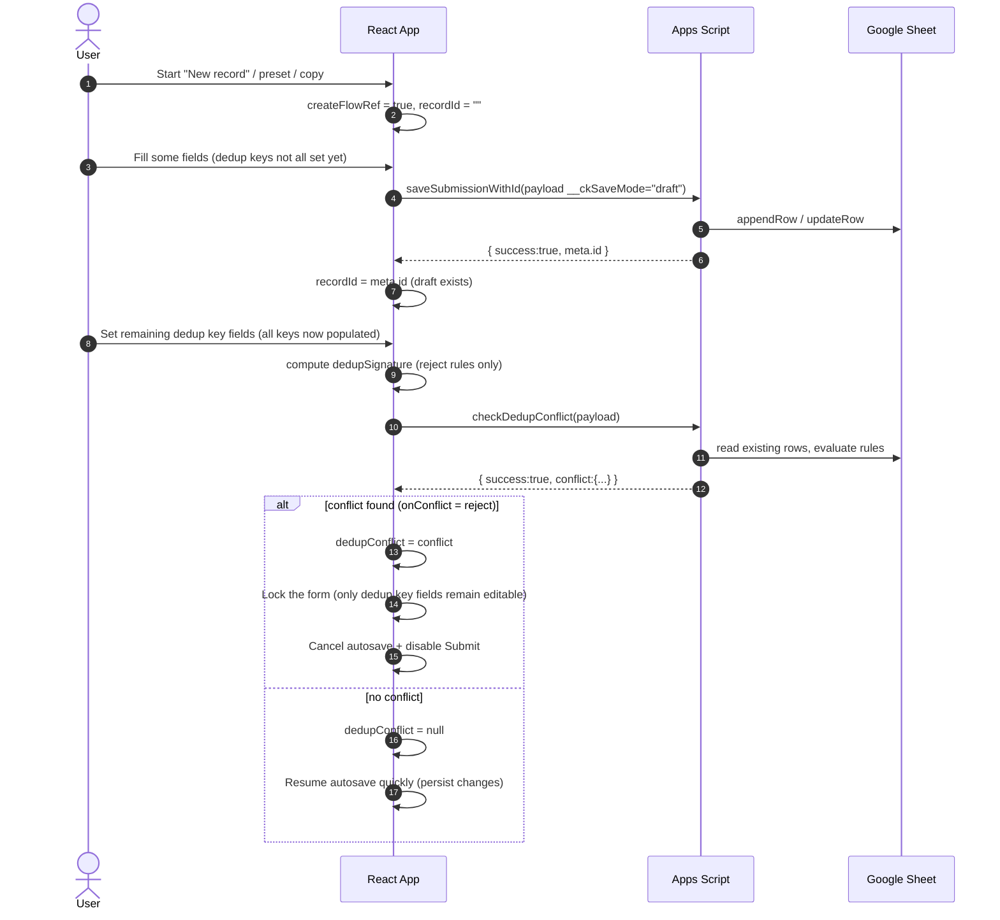
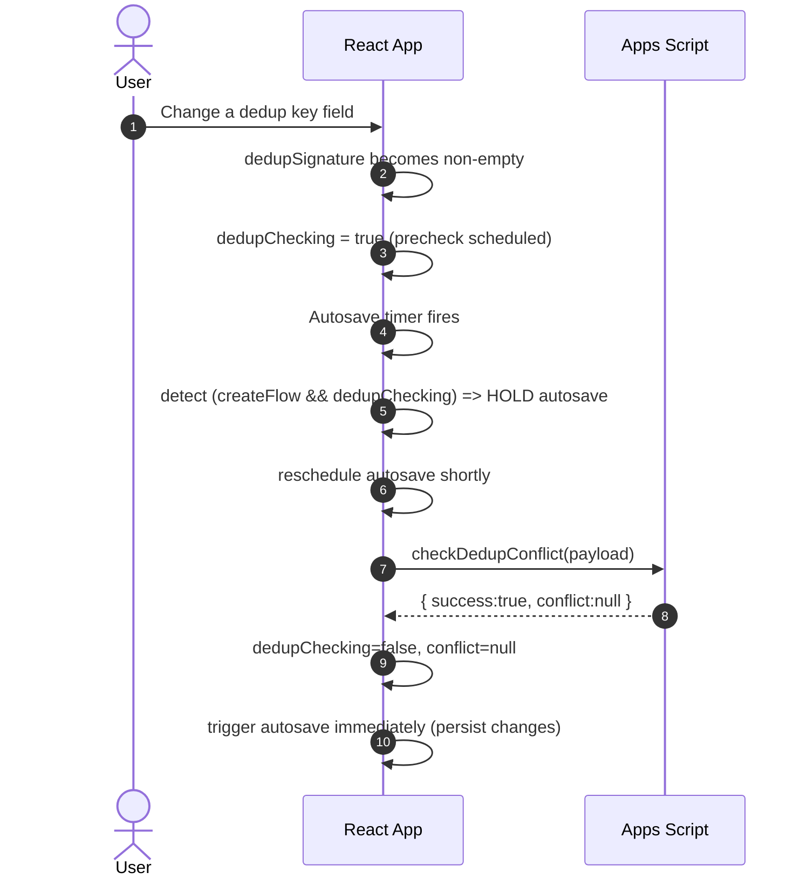

# Dedup rules (duplicate prevention)

This document explains how **dedup rules** prevent users from creating duplicate records (e.g. same `DATE` + same `FREQUENCY`).

## Key concepts

- **Dedup rules** are configured in the sheet `<Config Sheet Name> Dedup`.
- A dedup rule is evaluated **only when all its key fields are populated**.
- In the UI we currently enforce “create-flow” dedup only for rules with `onConflict: reject`.
- The system uses a **server-side precheck** (`checkDedupConflict`) to avoid writing duplicates during draft autosave.

## Actors

- **User**: fills the form.
- **React App**: computes the dedup signature, calls precheck, blocks autosave/submit on conflicts.
- **Apps Script**: evaluates dedup rules against the Responses sheet.
- **Google Sheet**: stores records.

## Sequence: create new record → autosave draft → dedup keys set → conflict

## Sequence: create new record → dedup check running → autosave is held

## Notes / constraints

- **Drafts**: server-side `saveSubmissionWithId` currently skips dedup enforcement for `__ckSaveMode="draft"`, so the client must hold autosave until the precheck completes.
- **DATE fields**: server normalizes `DATE` values to “date-only” cells (midnight local time) before writing, to avoid Sheets storing them as date-time.
