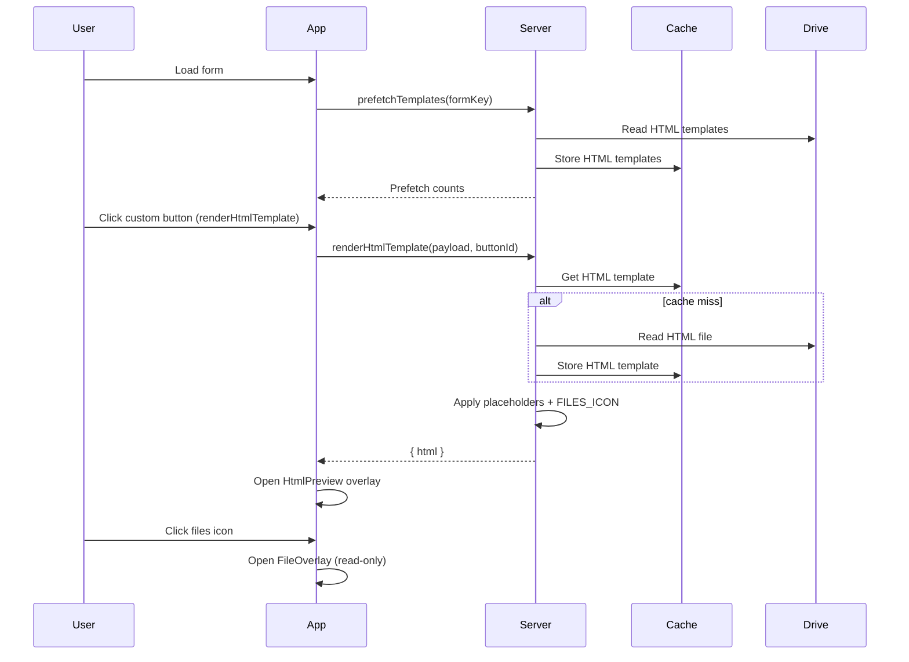

# HTML Template Button + File Icon Placeholder + ListView Button Target

## Goals
- Add a new BUTTON action to render HTML templates stored in Google Drive using existing placeholder rules.
- Prefetch and cache HTML templates at app load so the preview is as fast as Summary view.
- Add a FILE_UPLOAD icon placeholder that opens the FileOverlay in read-only mode.
- Allow ListView rule columns to target a custom button action instead of only form/summary.
- Allow the Summary system view to be fully replaced by a configured HTML template (in addition to custom buttons).

## Non-goals
- Replace existing Doc/Markdown template flows.
- Provide a full HTML template editor or WYSIWYG tooling.
- Introduce a new HTML line-item table syntax (initial pass relies on existing placeholder behaviors).

## Current behavior (relevant)
- Custom BUTTON actions are `renderDocTemplate`, `renderMarkdownTemplate`, and `createRecordPreset` in `src/types/index.ts`.
- `prefetchTemplates` caches Markdown templates (CacheService) and warms Doc metadata in `src/services/WebFormService.ts`.
- Report preview overlay supports PDF and Markdown only in `src/web/react/components/app/ReportOverlay.tsx`.
- FileOverlay is owned by FormView in `src/web/react/components/FormView.tsx`.
- ListView rule columns only support `openView: auto | form | summary` in `src/types/index.ts` and `src/web/react/components/ListView.tsx`.

## Proposed design

### 1) New BUTTON action: `renderHtmlTemplate`
**Config and schema**
- Extend `ButtonAction` union and `ButtonConfig` with:
  - `action: "renderHtmlTemplate"`
  - `templateId: TemplateIdMap` (same as Markdown/Doc)
  - `placements` (same as other actions)
- Update `config_schema.yaml` and `ConfigSheet.parseButtonConfig` to accept the new action.
- Update `Dashboard.normalizeActionBars` so action filters can include `renderHtmlTemplate`.

**Server**
- Add a new cache module similar to `markdownTemplateCache.ts`:
  - Key prefix: `ck.htmlTemplate.v1:`
  - TTL and size limits similar to Markdown (CacheService limit awareness).
  - Read Drive file as HTML text (`text/html` or `text/plain`) with a clear error when empty/unreadable.
- Add a renderer (new file `htmlRenderer.ts` or extend Markdown renderer pattern):
  - Resolve template id (TemplateIdMap).
  - Read cached HTML template or Drive fallback.
  - Build placeholders with `buildPlaceholderMap` + `addConsolidatedPlaceholders`.
  - Apply placeholders with `applyPlaceholders`.
  - Apply FILE icon placeholders (see section 2).
- Placeholder coverage requirements:
  - Top-level fields: `{{FIELD_ID}}` and label-slug variants (existing behavior).
  - Line item group fields: `{{GROUP.FIELD_ID}}` plus consolidated helpers like `{{CONSOLIDATED(GROUP.FIELD_ID)}}`, `{{COUNT(GROUP)}}`, `{{SUM(GROUP.FIELD_ID)}}`.
  - Subgroup fields: `{{GROUP.SUBGROUP.FIELD_ID}}` plus consolidated helpers like `{{CONSOLIDATED(GROUP.SUBGROUP.FIELD_ID)}}`, `{{COUNT(GROUP.SUBGROUP)}}`, `{{SUM(GROUP.SUBGROUP.FIELD_ID)}}`.
  - Line-item and subgroup row expansion should work the same as Doc/Markdown (see section 4).
- Add `WebFormService.renderHtmlTemplate` and export `renderHtmlTemplate` in `src/index.ts`.
- Extend `prefetchTemplates` to include HTML template ids from BUTTON configs and return counts:
  - `htmlRequested`, `htmlCacheHit`, `htmlLoaded`, `htmlSkippedCache`, `htmlFailed`.

**Client**
- Add `renderHtmlTemplateApi` returning `{ success, html, message? }`.
- Extend `ReportOverlayState` with `kind: "html"` and `html?: string`.
- Add `HtmlPreview` component to render the HTML string:
  - Use `dangerouslySetInnerHTML` inside a scoped container (or `iframe srcDoc` if isolation is required).
  - Attach a click handler for FILE icon placeholders (event delegation).
- Extend `handleCustomButton` to call `renderHtmlTemplateApi` and open the overlay.
- Allow inline BUTTON fields (`FormView.tsx`) to accept `renderHtmlTemplate`.

### 2) FILE_UPLOAD icon placeholder + read-only overlay
**Placeholder syntax**
- Introduce a token for HTML templates only:
  - `{{FILES_ICON(FIELD_ID)}}`
  - Optional future extension: `{{FILES_ICON(GROUP.FIELD_ID)}}` for line items.

**HTML rendering**
- When building placeholders for HTML templates, add entries for FILE_UPLOAD fields:
  - Determine file count from record values.
  - Respect `uploadConfig.ui.slotIcon` (camera vs clip) when choosing the icon.
  - Replace the placeholder with a small HTML snippet:
    - `<button data-ck-file-field="FIELD_ID" data-ck-file-count="N" type="button" class="ck-file-icon">...</button>`
  - Include a count badge if `N > 0`.

**Client interaction**
- `HtmlPreview` listens for clicks on `[data-ck-file-field]`.
- App opens a read-only FileOverlay using current record values:
  - Reuse `FileOverlay` component with `readOnly: true`.
  - Provide no-op add/remove handlers (disabled by `readOnly`).
- This overlay is available even when not on the Form view.

### 3) ListView rule column -> custom button target
**Config**
- Extend `ListViewRuleColumnConfig` with:
  - `openView: "auto" | "form" | "summary" | "button"`
  - `openButtonId?: string` (question id or encoded id using `__ckQIdx=` when needed).
- Update `config_schema.yaml` and `src/types/index.ts` accordingly.

**Runtime behavior**
- In `ListView.tsx`, when a rule column cell is clicked:
  - If `openView === "button"` and `openButtonId` is set, pass a new `onSelect` option containing the button id.
- In `App.tsx`, extend `handleRecordSelect`:
  - Load the record (as today).
  - If `openView === "button"`, queue a pending custom button action.
  - Once the record snapshot is ready, run `handleCustomButton(openButtonId)`.
- Restrict list-triggered actions to preview types (Doc/Markdown/HTML) and ignore `createRecordPreset` to avoid surprising list behavior.

### 4) HTML line-item and subgroup expansion
Use the same expansion rules as Doc/Markdown:
- Implement an `applyHtmlLineItemBlocks` pass analogous to `applyMarkdownLineItemBlocks`.
- Support the existing directives:
  - `{{ORDER_BY(...)}}`
  - `{{EXCLUDE_WHEN(...)}}`
  - `{{CONSOLIDATED_TABLE(GROUP.SUBGROUP)}}`
- Expand blocks for line-item placeholders:
  - Blocks with `GROUP.SUBGROUP.FIELD` repeat for each subgroup row.
  - Blocks with directives repeat per group or subgroup as in Markdown rules.
- Keep `{{GROUP.FIELD}}` placeholders outside expansion blocks as aggregated values (handled by `applyPlaceholders`).

### 5) Summary view replacement via HTML template
Add an optional config to replace the Summary system view with an HTML template:
- New config entry on form-level, e.g. `summaryHtmlTemplateId` (TemplateIdMap).
- When set, the Summary view is rendered using the HTML template instead of `ReportLivePreview`.
- Use the same placeholder pipeline as `renderHtmlTemplate` (including line-item expansion and FILE icon placeholders).
- Provide a fallback: if template rendering fails, show the existing Summary view with an error banner.

## Sequence diagram

## Data and API changes (summary)
- Types:
  - `ButtonAction` add `renderHtmlTemplate`.
  - `RenderHtmlTemplateButtonConfig` added to `ButtonConfig`.
  - `ListViewRuleColumnConfig` add `openView: "button"` + `openButtonId`.
- Summary replacement: add `summaryHtmlTemplateId` (TemplateIdMap) to form config types + schema.
- API:
  - `renderHtmlTemplate` Apps Script entrypoint.
  - `renderHtmlTemplateApi` client wrapper.
  - `PrefetchTemplatesResult` includes HTML counts.
- UI:
  - `ReportOverlay` supports `kind: "html"` and a new `HtmlPreview`.
  - App-level read-only FileOverlay triggered by HTML preview.
  - Summary view can be replaced by HTML template rendering.

## Risks and mitigations
- HTML injection: use a scoped container and consider stripping `<script>` tags or using `iframe sandbox` if templates are not trusted.
- Cache limits: HTML templates larger than CacheService limits should still render (cache skip + Drive read).
- List view triggers: ensure custom button execution waits for the full record snapshot.

## Open questions
- Placeholder values are inserted as data only (no HTML escaping beyond the injected template).
- Line-item and subgroup expansion matches Doc/Markdown behavior.
- Summary view replacement is supported via a form-level HTML template setting.
