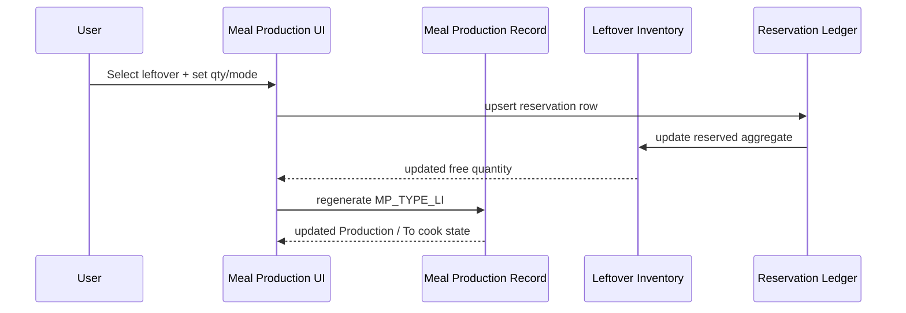
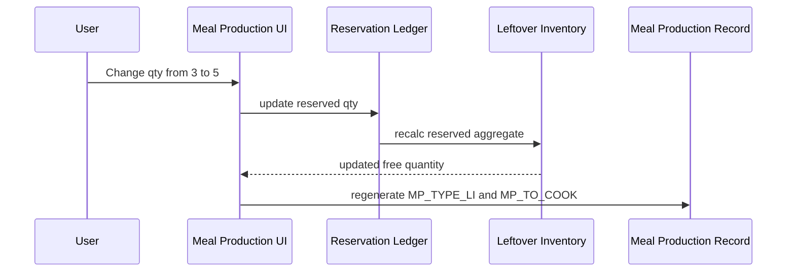
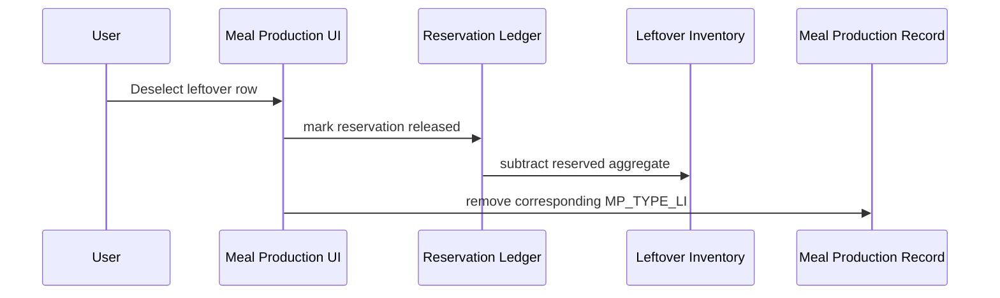
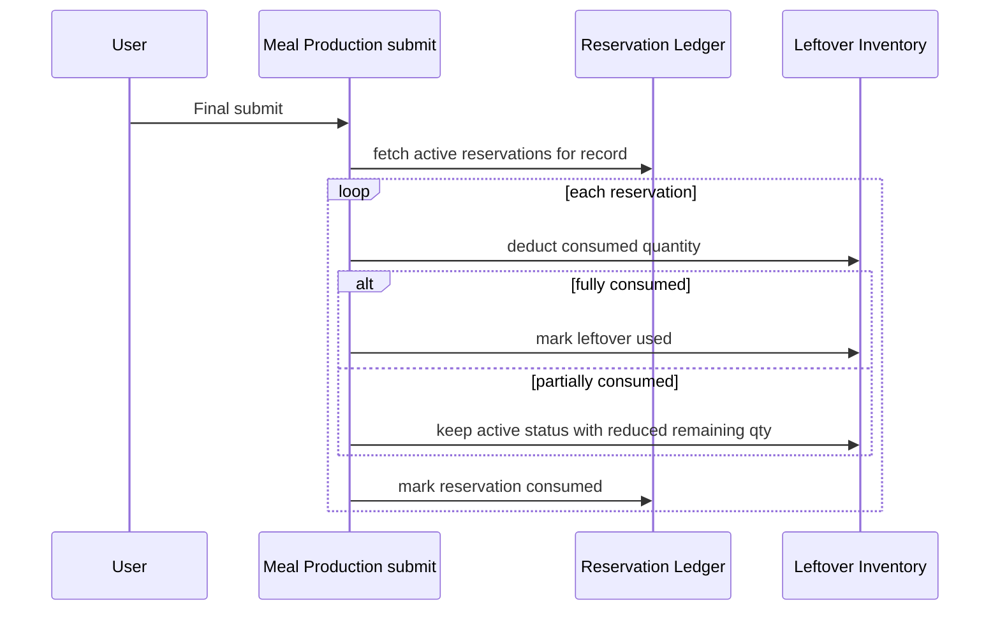

# Leftover Inventory Reservation Lifecycle Design

## Purpose

This document defines the detailed functional design and implementation plan for the reservation-aware inventory lifecycle that powers the Meal Production `2. Leftover` step.

It focuses on:

- availability
- reservation
- usage
- release
- final consumption reconciliation

This is the detailed companion to:

- `docs/leftover-inventory/implementation-plan.md`

## Scope

This design covers only the inventory lifecycle relevant to leftover usage.

It does not cover:

- the later `6. Leftover registration` step in full detail
- report-template redesign
- unrelated Meal Production UI behavior

## Functional logic

### Core principle

A leftover item is not locked as a whole record when selected.

Instead, the system reserves a quantity from that item.

This allows:

- one leftover item to be used by multiple dish rows in the same Meal Production record
- one leftover item to be used by multiple different Meal Production records
- safe concurrent usage as long as free quantity remains available

### Terminology

- `remaining quantity`
  - the quantity physically still present in inventory before considering active reservations
- `reserved quantity`
  - the quantity currently held by open Meal Production records
- `free quantity`
  - the quantity that may still be selected by users
- `consumed quantity`
  - the quantity actually used after final Meal Production submission

### Quantity model

For `entireDish` leftovers:

- quantity type is `portions`
- `remaining quantity = LEFTOVER_PORTIONS`
- `reserved quantity = LEFTOVER_RESERVED_PORTIONS`
- `free quantity = LEFTOVER_PORTIONS - LEFTOVER_RESERVED_PORTIONS`

For `partialDish` leftovers:

- quantity type is `qty + unit`
- `remaining quantity = LEFTOVER_QTY`
- `reserved quantity = LEFTOVER_RESERVED_QTY`
- `free quantity = LEFTOVER_QTY - LEFTOVER_RESERVED_QTY`

The unit of a `partialDish` leftover must remain fixed for the record.

## User-facing behavior

### 1. Listing leftovers in `2. Leftover`

The list shows leftovers that are:

- not expired
- operationally active
- have `free quantity > 0`

Additionally, the same Meal Production record must still see its own active reservations even when those reservations bring free quantity to `0`.

### 2. Selecting a leftover

Selection is two-stage:

- the checkbox means the row is active in the UI
- the reservation becomes real only when the row has enough valid input to define a quantity reservation

For `entireDish`, the reservation becomes active when:

- checkbox is selected
- usage mode is set
- quantity to use is set and valid

For `partialDish`, the reservation becomes active when:

- checkbox is selected
- quantity to use is set and valid

### 3. Editing a selected leftover

When the user changes:

- quantity
- usage mode
- selection state

the system must immediately:

- recompute the reservation row
- recompute the aggregate reserved quantity on inventory
- regenerate the corresponding `MP_TYPE_LI`
- recompute `MP_TO_COOK` and downstream `Production` state

### 4. Deselecting a leftover

When the row is deselected:

- the reservation row is released
- the inventory aggregate reserved quantity is reduced
- the corresponding `MP_TYPE_LI` row is removed

### 4a. Source-record deletion

When the source record is deleted before final submit:

- all active reservations for that source record are released
- the inventory aggregate reserved quantity is reduced
- inventory remaining quantity is not consumed

This must cover:

- dedup-key delete/recreate flows
- delete-on-leave / delete-on-home flows
- any other configured source-record deletion path

### 4b. End-of-day stale release

When the daily lifecycle trigger runs after the operational day has ended:

- stale source records with still-active reservations must have those reservations released
- inventory remaining quantity is not consumed
- release must be driven by generic configuration on the source form

This is the safety net for unfinished Meal Production records that were never finally submitted.

### 5. Final submit

On final Meal Production submission:

- active reservations belonging to that record are reconciled into actual usage
- used quantity is deducted from inventory
- fully consumed leftovers become `used`
- partially consumed leftovers remain operationally active and their remaining quantity is reduced in place
- reservation rows for that record are closed as `consumed`

## Proposed data model

### A. Leftover Inventory

Recommended top-level fields:

- `LEFTOVER_ID`
- `LEFTOVER_KIND`
- `LEFTOVER_STATUS`
- `LEFTOVER_RECIPE`
- `LEFTOVER_INGREDIENT`
- `LEFTOVER_CAT`
- `LEFTOVER_ALLERGEN`
- `LEFTOVER_QTY`
- `LEFTOVER_UNIT`
- `LEFTOVER_PORTIONS`
- `LEFTOVER_RESERVED_QTY`
- `LEFTOVER_RESERVED_PORTIONS`
- `LEFTOVER_EXP_DATE`
- `LEFTOVER_SOURCE_FORM_KEY`
- `LEFTOVER_SOURCE_RECORD_ID`
- `LEFTOVER_SOURCE_MEAL_ROW_ID`
- `LEFTOVER_USED_BY_FORM_KEY`
- `LEFTOVER_USED_BY_RECORD_ID`
- `LEFTOVER_NOTES`

Recommended line-item group:

- `LEFTOVER_INGREDIENTS_LI`

Recommended line-item row fields:

- `ING`
- `QTY`
- `UNIT`
- `CAT`
- `ALLERGEN`

### B. Reservation ledger

Recommended new form:

- `Config: Inventory Reservation Ledger`

Recommended fields:

- `RESERVATION_ID`
- `RESOURCE_FORM_KEY`
- `RESOURCE_RECORD_ID`
- `RESOURCE_ITEM_ID`
- `RESOURCE_KIND`
- `RESERVED_QTY`
- `RESERVED_UNIT`
- `STATUS`
- `SOURCE_FORM_KEY`
- `SOURCE_RECORD_ID`
- `SOURCE_PARENT_GROUP_ID`
- `SOURCE_PARENT_ROW_ID`
- `SOURCE_OUTPUT_GROUP_ID`
- `SOURCE_OUTPUT_ROW_ID`
- `CREATED_AT`
- `UPDATED_AT`

Recommended enum values:

- `STATUS = active | released | consumed`

### Why the ledger is needed

The inventory table alone cannot safely model:

- multiple reservations against the same leftover
- reservations from multiple Meal Production records
- reservations from multiple dish rows in one Meal Production record
- release vs final consumption history

The reservation ledger solves that without turning `MP_TYPE_LI` into the shared concurrency source.

`MP_TYPE_LI` remains the Meal Production internal normalized output.

The reservation ledger remains the server-side concurrency source.

## Performance strategy

The reservation ledger must not be implemented as a chain of independent client-server calls such as:

- read inventory
- read ledger
- write ledger
- write inventory

That approach would create slow selection UX and race conditions.

The correct performance model is:

- the client reads leftover availability from the inventory datasource only
- the inventory datasource already exposes aggregate availability fields
- reservation changes are written through a single atomic server endpoint

### Read path

The `2. Leftover` step should render from the inventory datasource only.

Each inventory row should provide enough aggregate data for the UI to decide whether the row is still usable:

- remaining quantity
- reserved quantity
- free quantity
- optional reserved quantity for the current Meal Production record

This avoids querying the ledger to paint the screen.

### Write path

Reservation mutations should go through one reusable atomic endpoint, for example:

- `upsertInventoryReservation`
- `releaseInventoryReservation`
- `reconcileInventoryReservations`

For a single selection or edit, the server call should:

1. load the authoritative inventory row
2. load the active reservation rows for that item
3. exclude the current reservation row if it already exists
4. compute free quantity
5. validate the requested reservation delta
6. write the reservation ledger row
7. update aggregate reserved quantity on inventory
8. return the new availability snapshot

That is one logical round trip from the client point of view.

### Client behavior

To keep the UI responsive:

- checkbox selection should activate the row locally
- the client should call the server only when the reservation input is valid
- quantity edits should be lightly debounced
- mode changes should reuse the same reservation row when quantity is unchanged
- the UI should update optimistically, then reconcile with the server response

When a reservation write is rejected, the response must include the fresh authoritative availability snapshot so the UI can immediately update the visible free quantity and roll back or adjust the invalid draft.

### Final submit

Final submission should not reconcile each leftover row with a separate client-side callback.

The record submit flow should issue one batched reconciliation operation for all active reservations belonging to that Meal Production record.

That batched server operation should:

- fetch all active reservation rows for the record
- apply final consumption to inventory
- close reservation rows as `consumed`
- release any rows that are no longer selected

This keeps submit latency bounded and avoids per-row round trips.

## Concurrency and over-reservation handling

Concurrency must be enforced on the server.

The client may display stale free quantity briefly, but the server must be authoritative.

### Server rule

For every reservation mutation:

- compute `free quantity` from the latest persisted inventory and active ledger rows
- subtract active reservations from other rows and records
- allow the mutation only if the requested quantity is less than or equal to the authoritative free quantity plus the quantity already reserved by the current reservation row

Formally:

- `freeForRequest = remaining - reservedByOthers`

The current reservation row is excluded from `reservedByOthers` so edits from `3 -> 5` only need `2` more units of free quantity, not `5`.

### Example

Suppose `LE-12` has:

- remaining portions: `10`

User A opens the record and reserves `6`.

At the same time, User B opens another record and tries to reserve `5`.

Correct outcome:

- User A succeeds first, reserved total becomes `6`, free becomes `4`
- User B's request is evaluated against the latest server state
- User B's request for `5` is rejected because only `4` are free

The server must return a structured conflict response such as:

- requested quantity
- authoritative free quantity
- inventory item id
- optional latest aggregate snapshot

The client then:

- rolls back the optimistic reservation change
- updates the displayed free quantity
- shows a clear message like:
  - `Only 4 portions are currently available for LE-12.`

This refresh behavior is mandatory.

Every rejected reservation response must return the fresh authoritative availability snapshot so the client can immediately repaint the row with the latest values.

Minimum response payload:

- `resource item id`
- `remaining quantity`
- `reserved quantity`
- `free quantity`
- `current record reserved quantity` when applicable
- conflict message / error code

### Same-row edit case

If User A already reserved `6` and edits to `8`:

- the server excludes User A's existing reservation row while computing `reservedByOthers`
- only the delta needs to be available

If `reservedByOthers = 1` and remaining is `10`, then:

- `freeForRequest = 10 - 1 = 9`
- User A may hold up to `9`

### Conflict resolution policy

The policy should be:

- first successful server write wins
- later conflicting writes are rejected
- the client refreshes from the server snapshot and asks the user to adjust

The system must not silently overbook or silently clip the quantity without telling the user.

## Derived server-side values

The server should be able to compute these generic values for any reservable inventory record:

- `reservedTotal`
- `freeTotal`
- `activeReservationCount`
- `reservedByCurrentRecord`

For the leftover use case:

- `reservedTotal = sum(active reservation quantities for this leftover item)`
- `freeTotal = remaining - reservedTotal`

## Normalization into `MP_TYPE_LI`

### Entire dish + Reheat

Create one `MP_TYPE_LI` row with:

- `PREP_TYPE = Entire dish`
- `PREP_QTY = reserved quantity`
- leftover source ids
- `MP_INGREDIENTS_LI` copied from `LEFTOVER_INGREDIENTS_LI`

### Entire dish + Combine

Create one `MP_TYPE_LI` row with:

- `PREP_TYPE = Entire dish`
- `PREP_QTY = 0`
- leftover source ids
- `MP_INGREDIENTS_LI` copied from `LEFTOVER_INGREDIENTS_LI`

### Partial dish

Create one `MP_TYPE_LI` row with:

- `PREP_TYPE = Part dish`
- `PREP_QTY = reserved quantity`
- leftover source ids
- one `MP_INGREDIENTS_LI` row from:
  - `LEFTOVER_INGREDIENT -> ING`
  - `LEFTOVER_QTY -> QTY`
  - `LEFTOVER_UNIT -> UNIT`
  - `LEFTOVER_CAT -> CAT`
  - `LEFTOVER_ALLERGEN -> ALLERGEN`

## Sequence diagrams

### 1. Select and reserve leftover

### 2. Edit reservation quantity

### 3. Deselect leftover

### 4. Final submit

## Implementation plan

### Phase 1. Data model

- add `LEFTOVER_RESERVED_QTY`
- add `LEFTOVER_RESERVED_PORTIONS`
- add new `Config: Inventory Reservation Ledger`
- add bundled staging config for the ledger

### Phase 2. Generic platform support

- add generic reservation upsert effect
- add generic reservation release effect
- add generic quantity reconciliation effect
- add datasource support to expose free quantity and current-record reservation state

### Phase 3. Meal Production wiring

- make `2. Leftover` reserve quantities server-side
- keep `MP_TYPE_LI` as immediate normalized output
- ensure the same leftover can appear under multiple dish rows while quantity remains free

### Phase 4. Submit-time reconciliation

- consume active reservations on final submit
- update remaining inventory quantity
- close reservation rows

### Phase 5. Validation and concurrency

- reject over-reservation server-side even if client state is stale
- refresh free quantity after every reservation mutation
- add regression coverage for:
  - two dish rows in same record sharing one leftover
  - two records reserving one leftover concurrently
  - deselection release
  - partial final consumption

## Resolved decisions

### Inventory status model

The `selected` status is no longer needed.

Inventory status should remain focused on operational state only:

- `available`
- `used`
- `expired`

Reservations are modeled exclusively through the reservation ledger and inventory aggregate reserved fields.

This is the recommended design because:

- one leftover can be partially reserved by multiple dish rows
- one leftover can be partially reserved by multiple records
- `selected` cannot represent concurrent partial reservations correctly

Therefore:

- reservation state lives in the ledger
- operational state lives on the inventory record
- availability is computed from remaining quantity minus reserved quantity

## Remaining implementation backlog

This backlog lists what is still pending from this design, in dependency order.

### 1. Final submit reconciliation

This is the main remaining lifecycle gap.

Required work:

- add one batched server operation to reconcile all active reservations for the submitted Meal Production record
- deduct consumed quantity from inventory remaining quantity
- mark fully consumed leftovers as `used`
- keep partially consumed leftovers as `available` with reduced remaining quantity
- mark ledger rows as `consumed`
- release any no-longer-selected active reservation rows that still belong to the record

Expected result:

- the reservation lifecycle is closed correctly at final submit
- inventory remaining quantity becomes the new source of truth after submit
- the ledger no longer has open `active` rows for completed records

### 2. Partial-consumption closeout

This is a specific part of final reconciliation that needs explicit coverage.

Required work:

- for `entireDish`, reduce `LEFTOVER_PORTIONS` by the consumed quantity
- for `partialDish`, reduce `LEFTOVER_QTY` by the consumed quantity
- keep unit unchanged for `partialDish`
- preserve the inventory record in place when quantity remains

Expected result:

- partially used leftovers remain available for future use
- only the remaining physical stock stays in inventory

### 3. Final release of unused reservations

Submit-time reconciliation must also handle rows that are no longer truly active.

Required work:

- detect reservation rows for the submitting record that should not be consumed
- release them in the same batched reconciliation call
- recompute aggregate reserved quantities on inventory after release

Expected result:

- no stale active reservations remain attached to a submitted record
- inventory free quantity is restored correctly

### 4. Full regression coverage for submit-time lifecycle

Reservation creation and concurrency are now covered much better than submit-time closeout.

Required work:

- add tests for:
  - full consumption
  - partial final consumption
  - release of unused reservations on submit
  - mixed record with consumed and released reservation rows
  - concurrency-safe reconciliation against latest inventory state

Expected result:

- submit-time behavior is protected against regressions the same way the `2. Leftover` step is now

### 5. UX refinement after reconciliation

The reservation UX is already functional, but it still needs post-reconciliation polish.

Required work:

- ensure final submit feedback clearly explains what was consumed and what was released when relevant
- keep optimistic availability updates consistent in every reservation mutation path
- continue tightening the compact leftover row controls for readability

Expected result:

- users understand why quantities changed
- the reservation flow feels immediate and predictable across concurrent edits and final submit
